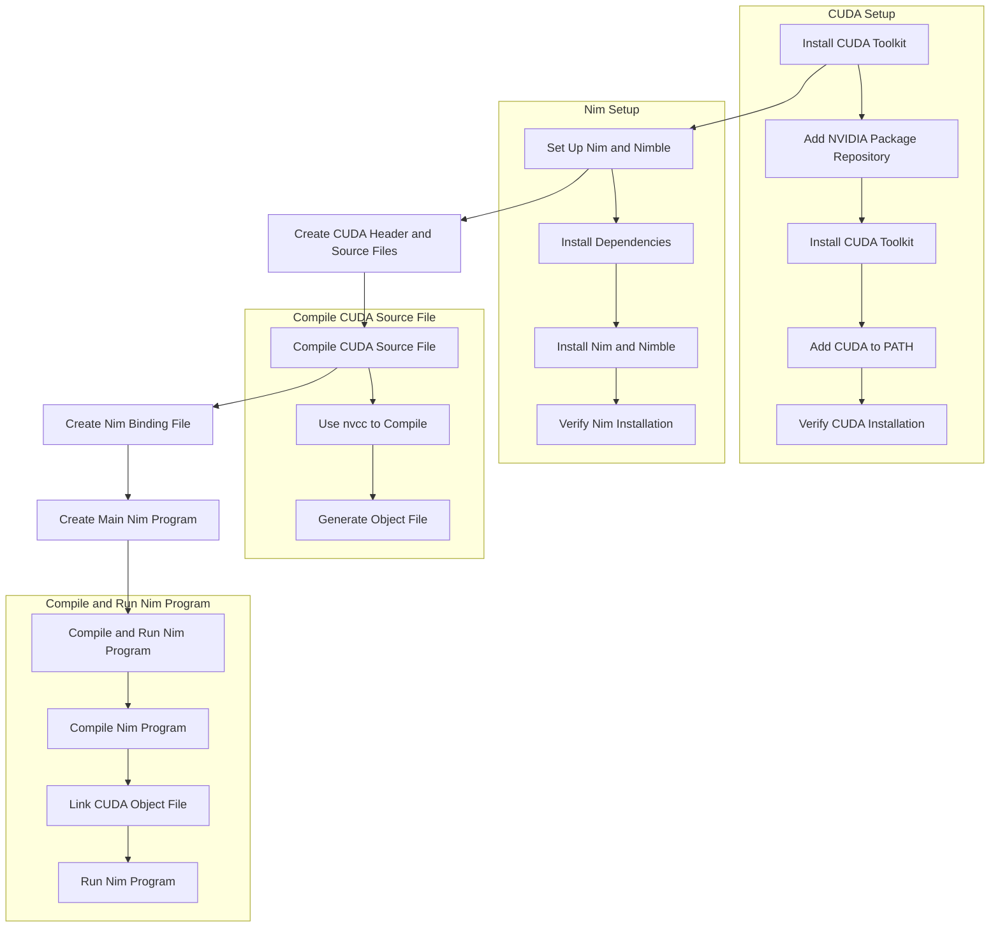

### Initial Request

1. **Lock-Free Data Structures Lexer/Parser in Nim**:
   - User requested generating lock-free data structures lexer/parser for Nim-generated code using Nim.

### Step-by-Step Implementation

2. **Basic Lock-Free Stack Implementation**:
   - **lockfree_stack.nim**: Implemented a lock-free stack using atomic operations.
     - `push` and `pop` operations ensure lock-free concurrent access.

3. **Basic Lexer Implementation**:
   - **lexer.nim**: Created a simple lexer to tokenize mathematical expressions.
     - Tokens included numbers, operators, parentheses, and identifiers.

4. **Basic Parser Implementation Using Lock-Free Stack**:
   - **parser.nim**: Implemented a parser that uses the lock-free stack to store tokens and build an Abstract Syntax Tree (AST).
     - Demonstrated parsing an expression and printing the AST.

### Enhancements for More Complex Grammars

5. **Extended Lexer**:
   - **lexer.nim**: Enhanced the lexer to recognize additional tokens (e.g., assignment, semicolon, comparison operators).

6. **Extended Parser**:
   - **parser.nim**: Improved the parser to handle more complex expressions, including operator precedence and associativity.
     - Defined more node types for the AST.
     - Implemented functions to parse primary expressions, binary operations with precedence, and full expressions.

### Detailed Steps to Compile and Run

7. **Compiling the CUDA Source File**:
   - Used `nvcc` to compile the CUDA source file (`cuda_example.cu`) into an object file (`cuda_example.o`).

8. **Compiling and Running the Nim Program**:
   - Ensured the CUDA object file is linked during Nim compilation.
   - Used Nim's compiler to compile and run the Nim program.

### Example Code

- **Lock-Free Stack (`lockfree_stack.nim`)**:
  - Implemented basic lock-free stack operations using atomic CAS.

- **Extended Lexer (`lexer.nim`)**:
  - Recognized numbers, operators, parentheses, identifiers, assignment, semicolon, and comparison operators.

- **Extended Parser (`parser.nim`)**:
  - Built a more sophisticated AST.
  - Parsed expressions considering operator precedence and associativity.

### Summary

The discussion began with generating a lock-free data structures lexer/parser in Nim. We implemented a lock-free stack, created a basic lexer and parser, and extended them to handle more complex grammars and data structures. We also detailed the steps to compile CUDA source files and run the Nim program, demonstrating integration of high-performance GPU computations within Nim.

Here's a mermaid diagram to illustrate the steps for setting up a CUDA Nim stack installation.

### Explanation of the Steps

#### 1. CUDA Setup

1. **Add NVIDIA Package Repository**:
    - Add the repository key and list for CUDA toolkit.

2. **Install CUDA Toolkit**:
    - Update package lists and install the CUDA toolkit.

3. **Add CUDA to PATH**:
    - Add CUDA paths to environment variables for easy access.

4. **Verify CUDA Installation**:
    - Check if CUDA is installed correctly using `nvcc --version`.

#### 2. Nim Setup

1. **Install Dependencies**:
    - Install build-essential tools and curl.

2. **Install Nim and Nimble**:
    - Use the choosenim script to install Nim and Nimble.

3. **Verify Nim Installation**:
    - Check Nim installation using `nim --version`.

#### 3. Create CUDA Header and Source Files

- Create `cuda_example.h` and `cuda_example.cu` files for CUDA functions.

#### 4. Compile CUDA Source File

1. **Use `nvcc` to Compile**:
    - Compile the CUDA source file using the `nvcc` compiler.

2. **Generate Object File**:
    - Produce the object file (`cuda_example.o`).

#### 5. Create Nim Binding File

- Define CUDA bindings in `cuda_example.nim`.

#### 6. Create Main Nim Program

- Write the main Nim program in `main.nim` to use the CUDA functions.

#### 7. Compile and Run Nim Program

1. **Compile Nim Program**:
    - Compile the Nim program with the Nim compiler.

2. **Link CUDA Object File**:
    - Ensure the CUDA object file is linked during Nim compilation.

3. **Run Nim Program**:
    - Execute the compiled Nim program.
