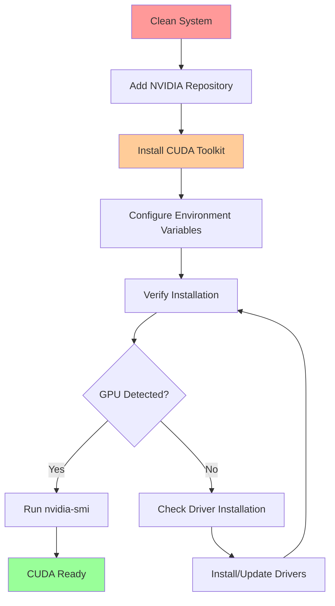
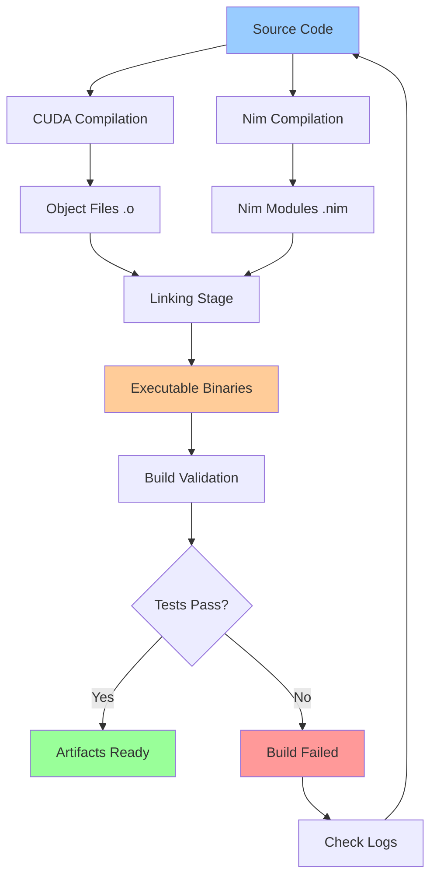
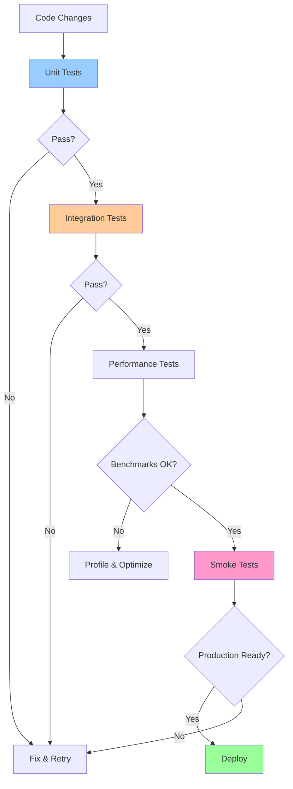
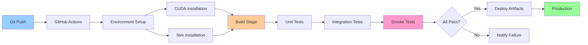
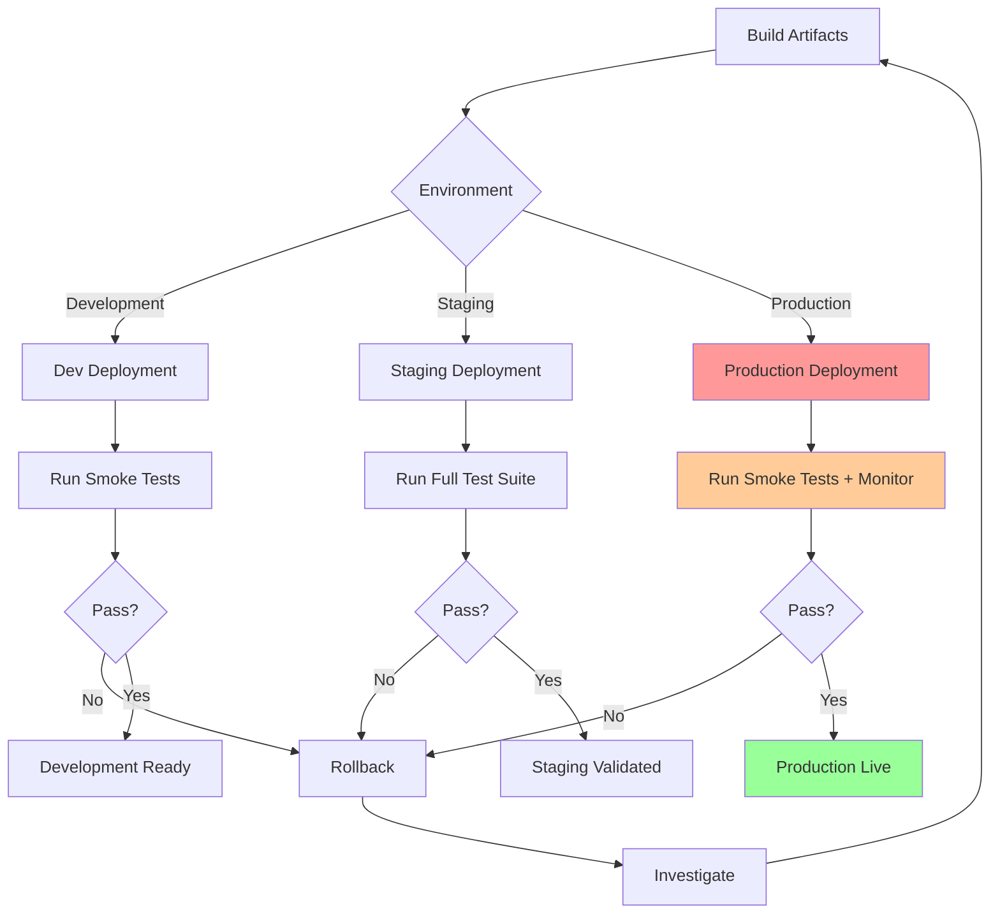
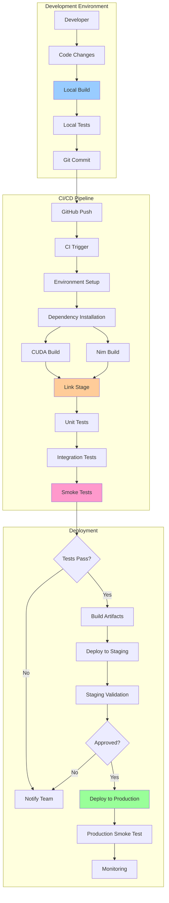

# GPT Nim - Build, Validation & Deployment Pipeline

A comprehensive guide for deploying and validating CUDA-accelerated Nim applications from bare metal setup through smoke testing and continuous integration.

## Table of Contents

- [Overview](#overview)
- [Bare Metal Prerequisites](#bare-metal-prerequisites)
- [Environment Setup](#environment-setup)
- [Build Pipeline](#build-pipeline)
- [Validation & Testing](#validation--testing)
- [CI/CD Pipeline](#cicd-pipeline)
- [Smoke Testing](#smoke-testing)
- [Deployment Workflow](#deployment-workflow)
- [Troubleshooting](#troubleshooting)
- [Pipeline Architecture](#pipeline-architecture)

---

## Overview

This document provides a comprehensive guide for setting up, building, validating, and deploying the GPT Nim project in production environments. The pipeline emphasizes:

- **Bare Metal Setup**: From clean system to production-ready environment
- **Build Validation**: Multi-stage verification and compilation
- **Automated Testing**: Unit, integration, and smoke tests
- **CI/CD Integration**: GitHub Actions and automated deployment
- **Performance Benchmarking**: GPU acceleration validation

### Pipeline Stages


---

## Bare Metal Prerequisites

### Hardware Requirements

#### Minimum Requirements
- **CPU**: x86_64 architecture, 4+ cores
- **RAM**: 8 GB minimum, 16 GB recommended
- **Storage**: 50 GB available space
- **GPU**: NVIDIA GPU with Compute Capability 3.5+ (for CUDA workloads)

#### Recommended Specifications
- **CPU**: AMD Ryzen 5/Intel i5 or better (8+ cores)
- **RAM**: 32 GB for parallel builds and testing
- **Storage**: 100 GB SSD (NVMe preferred)
- **GPU**: NVIDIA RTX series or Tesla/A100 for production workloads

### Operating System

**Supported Distributions:**
- Ubuntu 20.04 LTS / 22.04 LTS (recommended)
- Debian 11 (Bullseye) / 12 (Bookworm)
- RHEL 8 / Rocky Linux 8
- Fedora 36+

**Kernel Requirements:**
- Linux Kernel 4.4+ (5.x recommended)
- NVIDIA driver compatibility: 470.x or newer

### Pre-Installation Verification

```bash
# Check CPU architecture
uname -m  # Should output: x86_64

# Check available RAM
free -h

# Check available disk space
df -h /

# Check kernel version
uname -r

# Verify system is up to date
sudo apt-get update && sudo apt-get upgrade -y  # Ubuntu/Debian
# OR
sudo dnf update -y  # Fedora/RHEL
```

---

## Environment Setup

### Stage 1: System Dependencies

```bash
# Update package repositories
sudo apt-get update

# Install build essentials
sudo apt-get install -y \
    build-essential \
    curl \
    wget \
    git \
    cmake \
    pkg-config \
    ca-certificates \
    gnupg \
    lsb-release

# Install development libraries
sudo apt-get install -y \
    libssl-dev \
    zlib1g-dev \
    libbz2-dev \
    libreadline-dev \
    libsqlite3-dev \
    libncursesw5-dev \
    xz-utils \
    tk-dev \
    libxml2-dev \
    libxmlsec1-dev \
    libffi-dev \
    liblzma-dev
```

### Stage 2: CUDA Toolkit Installation



#### CUDA Installation Steps

```bash
# Remove any existing CUDA/NVIDIA installations (optional but recommended)
sudo apt-get --purge remove "*nvidia*" "*cuda*"
sudo apt-get autoremove

# Add NVIDIA package repositories
wget https://developer.download.nvidia.com/compute/cuda/repos/ubuntu2204/x86_64/cuda-keyring_1.1-1_all.deb
sudo dpkg -i cuda-keyring_1.1-1_all.deb
sudo apt-get update

# Install CUDA Toolkit (12.x series)
sudo apt-get install -y cuda-toolkit-12-3

# Install NVIDIA drivers (if not already installed)
sudo apt-get install -y nvidia-driver-535

# Reboot to load drivers
sudo reboot
```

#### Post-Installation Configuration

```bash
# Add CUDA to PATH and LD_LIBRARY_PATH
cat >> ~/.bashrc << 'EOF'
# CUDA Configuration
export PATH=/usr/local/cuda-12.3/bin${PATH:+:${PATH}}
export LD_LIBRARY_PATH=/usr/local/cuda-12.3/lib64${LD_LIBRARY_PATH:+:${LD_LIBRARY_PATH}}
export CUDA_HOME=/usr/local/cuda-12.3
EOF

# Reload shell configuration
source ~/.bashrc

# Verify CUDA installation
nvcc --version
nvidia-smi

# Test CUDA with sample
cd /usr/local/cuda-12.3/samples/1_Utilities/deviceQuery
sudo make
./deviceQuery
```

**Expected Output:**
```
CUDA Device Query (Runtime API) version (CUDART static linking)
Detected 1 CUDA Capable device(s)
Device 0: "NVIDIA GeForce RTX ..."
  CUDA Capability Major/Minor version number: 8.6
  ...
Result = PASS
```

### Stage 3: Nim Installation

```bash
# Method 1: Using choosenim (recommended)
curl https://nim-lang.org/choosenim/init.sh -sSf | sh

# Add to PATH
export PATH=$HOME/.nimble/bin:$PATH
echo 'export PATH=$HOME/.nimble/bin:$PATH' >> ~/.bashrc

# Verify installation
nim --version
nimble --version

# Method 2: From source (for specific versions)
git clone https://github.com/nim-lang/Nim.git
cd Nim
git clone --depth 1 https://github.com/nim-lang/csources_v1.git csources
cd csources && sh build.sh
cd ..
bin/nim c koch
./koch boot -d:release
./koch tools
```

### Stage 4: Project Dependencies

```bash
# Clone the repository
git clone https://github.com/yourusername/gpt_Nim.git
cd gpt_Nim

# Install Nim dependencies (if nimble package exists)
nimble install -y

# Verify directory structure
tree -L 2 -d
```

---

## Build Pipeline

### Build Stages Overview



### Stage 1: CUDA Kernel Compilation

```bash
# Navigate to CUDA source directory
cd grimlock

# Compile CUDA kernels
nvcc -c -o cuda_kernels.o cuda_kernels.cu \
    --compiler-options '-fPIC' \
    -arch=sm_86 \
    --ptxas-options=-v

# Verify object file creation
ls -lh cuda_kernels.o

# Optional: Generate PTX for inspection
nvcc -ptx cuda_kernels.cu -o cuda_kernels.ptx
```

**Build Flags Explained:**
- `-c`: Compile without linking
- `-fPIC`: Position Independent Code (required for shared libraries)
- `-arch=sm_86`: Target compute capability (adjust for your GPU)
- `--ptxas-options=-v`: Verbose PTX assembler output

### Stage 2: Nim Module Compilation

```bash
# Compile lock-free data structures
nim c --threads:on \
      --opt:speed \
      --passL:"cuda_kernels.o -lcudart -L/usr/local/cuda/lib64" \
      lockfree_stack.nim

# Compile lexer module
nim c --opt:speed lexer.nim

# Compile parser module
nim c --opt:speed parser.nim

# Compile with CUDA integration
nim c --threads:on \
      --opt:speed \
      --passL:"cuda_kernels.o" \
      --passL:"-lcudart" \
      --passL:"-L/usr/local/cuda/lib64" \
      main.nim
```

**Nim Compiler Flags:**
- `--threads:on`: Enable thread support
- `--opt:speed`: Optimize for execution speed
- `--passL`: Pass flags to linker
- `--gc:arc`: Use ARC memory management (recommended for low-latency)

### Stage 3: Build Automation Script

Create `build.sh` for automated builds:

```bash
#!/bin/bash
set -euo pipefail

# Colors for output
RED='\033[0;31m'
GREEN='\033[0;32m'
YELLOW='\033[1;33m'
NC='\033[0m'

echo -e "${GREEN}=== GPT Nim Build Pipeline ===${NC}"

# Stage 1: Environment Check
echo -e "${YELLOW}[1/5] Checking environment...${NC}"
command -v nvcc >/dev/null 2>&1 || { echo -e "${RED}CUDA not found${NC}"; exit 1; }
command -v nim >/dev/null 2>&1 || { echo -e "${RED}Nim not found${NC}"; exit 1; }
nvidia-smi >/dev/null 2>&1 || { echo -e "${RED}NVIDIA GPU not detected${NC}"; exit 1; }
echo -e "${GREEN}✓ Environment OK${NC}"

# Stage 2: Clean previous builds
echo -e "${YELLOW}[2/5] Cleaning previous builds...${NC}"
rm -f grimlock/*.o grimlock/nimcache -rf
echo -e "${GREEN}✓ Clean complete${NC}"

# Stage 3: Compile CUDA kernels
echo -e "${YELLOW}[3/5] Compiling CUDA kernels...${NC}"
cd grimlock
nvcc -c -o cuda_kernels.o cuda_kernels.cu \
    --compiler-options '-fPIC' \
    -arch=sm_86 \
    --ptxas-options=-v || { echo -e "${RED}CUDA compilation failed${NC}"; exit 1; }
cd ..
echo -e "${GREEN}✓ CUDA kernels compiled${NC}"

# Stage 4: Compile Nim modules
echo -e "${YELLOW}[4/5] Compiling Nim modules...${NC}"
nim c --threads:on --opt:speed \
    --passL:"grimlock/cuda_kernels.o" \
    --passL:"-lcudart -L/usr/local/cuda/lib64" \
    grimlock/main.nim || { echo -e "${RED}Nim compilation failed${NC}"; exit 1; }
echo -e "${GREEN}✓ Nim modules compiled${NC}"

# Stage 5: Verify binaries
echo -e "${YELLOW}[5/5] Verifying build artifacts...${NC}"
test -f grimlock/main || { echo -e "${RED}Binary not found${NC}"; exit 1; }
ldd grimlock/main | grep cuda || { echo -e "${RED}CUDA library not linked${NC}"; exit 1; }
echo -e "${GREEN}✓ Build verification passed${NC}"

echo -e "${GREEN}=== Build Complete ===${NC}"
```

Make executable and run:

```bash
chmod +x build.sh
./build.sh
```

---

## Validation & Testing

### Testing Strategy



### Stage 1: Unit Tests

Create `tests/test_lockfree.nim`:

```nim
import unittest
import ../grimlock/lockfree_stack

suite "Lock-Free Stack Tests":
  setup:
    var stack = initLockFreeStack[int]()

  test "Push and Pop single element":
    stack.push(42)
    let val = stack.pop()
    check val.isSome
    check val.get() == 42

  test "Pop from empty stack":
    let val = stack.pop()
    check val.isNone

  test "Multiple push and pop":
    for i in 1..100:
      stack.push(i)

    var count = 0
    while stack.pop().isSome:
      count += 1

    check count == 100

  test "Concurrent access":
    import threadpool

    proc pusher() =
      for i in 1..1000:
        stack.push(i)

    spawn pusher()
    spawn pusher()
    sync()

    var count = 0
    while stack.pop().isSome:
      count += 1

    check count == 2000
```

Run tests:

```bash
# Compile and run tests
nim c -r tests/test_lockfree.nim

# Run with verbose output
nim c -r --verbosity:2 tests/test_lockfree.nim

# Run with memory checking
nim c -r --debugger:native -d:useMalloc tests/test_lockfree.nim
```

### Stage 2: Integration Tests

Create `tests/test_cuda_integration.nim`:

```nim
import unittest
import ../grimlock/cuda_wrapper

suite "CUDA Integration Tests":
  test "CUDA device detection":
    let deviceCount = getCudaDeviceCount()
    check deviceCount > 0

  test "Memory allocation":
    var devPtr: pointer
    let size = 1024 * 1024  # 1 MB
    let status = cudaMalloc(addr devPtr, size)
    check status == cudaSuccess
    cudaFree(devPtr)

  test "Kernel execution":
    # Test vector addition kernel
    let n = 1000
    var h_a, h_b, h_c: seq[float32]
    newSeq(h_a, n)
    newSeq(h_b, n)
    newSeq(h_c, n)

    # Initialize input
    for i in 0..<n:
      h_a[i] = float32(i)
      h_b[i] = float32(i * 2)

    # Run CUDA kernel
    vectorAdd(n, h_a[0].addr, h_b[0].addr, h_c[0].addr)

    # Verify results
    for i in 0..<n:
      check abs(h_c[i] - float32(i * 3)) < 0.001
```

### Stage 3: Automated Test Runner

Create `run_tests.sh`:

```bash
#!/bin/bash
set -euo pipefail

echo "=== Running Test Suite ==="

# Unit tests
echo "[1/3] Running unit tests..."
nim c -r tests/test_lockfree.nim || exit 1
echo "✓ Unit tests passed"

# Integration tests
echo "[2/3] Running integration tests..."
nim c -r tests/test_cuda_integration.nim || exit 1
echo "✓ Integration tests passed"

# Performance benchmarks
echo "[3/3] Running benchmarks..."
nim c -r -d:release tests/benchmark.nim || exit 1
echo "✓ Benchmarks complete"

echo "=== All Tests Passed ==="
```

---

## CI/CD Pipeline

### GitHub Actions Workflow

Create `.github/workflows/build-and-test.yml`:

```yaml
name: Build and Test

on:
  push:
    branches: [ main, develop ]
  pull_request:
    branches: [ main, develop ]

jobs:
  build:
    runs-on: ubuntu-latest

    steps:
    - name: Checkout code
      uses: actions/checkout@v3

    - name: Install CUDA Toolkit
      uses: Jimver/cuda-toolkit@v0.2.11
      with:
        cuda: '12.3.0'

    - name: Install Nim
      uses: jiro4989/setup-nim-action@v1
      with:
        nim-version: 'stable'

    - name: Cache dependencies
      uses: actions/cache@v3
      with:
        path: |
          ~/.nimble
          grimlock/nimcache
        key: ${{ runner.os }}-nimble-${{ hashFiles('*.nimble') }}

    - name: Verify environment
      run: |
        nvcc --version
        nim --version
        nvidia-smi

    - name: Build project
      run: ./build.sh

    - name: Run tests
      run: ./run_tests.sh

    - name: Upload artifacts
      uses: actions/upload-artifact@v3
      with:
        name: binaries
        path: |
          grimlock/main
          grimlock/*.o

  smoke-test:
    needs: build
    runs-on: ubuntu-latest

    steps:
    - name: Download artifacts
      uses: actions/download-artifact@v3
      with:
        name: binaries

    - name: Run smoke tests
      run: |
        chmod +x grimlock/main
        ./grimlock/main --smoke-test
```

### Pipeline Stages Visualization



---

## Smoke Testing

### Smoke Test Strategy

Smoke tests validate critical functionality in production-like environments:

1. **System Check**: Verify all dependencies available
2. **GPU Detection**: Ensure CUDA devices accessible
3. **Basic Operations**: Test core functionality
4. **Performance Baseline**: Quick benchmark validation

### Smoke Test Implementation

Create `tests/smoke_test.nim`:

```nim
import os, times, strformat

proc smokeTest(): bool =
  echo "=== GPT Nim Smoke Test ==="

  # Test 1: CUDA Device Detection
  echo "[1/5] Testing CUDA device detection..."
  try:
    let deviceCount = getCudaDeviceCount()
    if deviceCount == 0:
      echo "  ✗ No CUDA devices found"
      return false
    echo &"  ✓ Found {deviceCount} CUDA device(s)"
  except:
    echo "  ✗ CUDA detection failed"
    return false

  # Test 2: Lock-Free Stack
  echo "[2/5] Testing lock-free stack..."
  var stack = initLockFreeStack[int]()
  for i in 1..100:
    stack.push(i)

  var popCount = 0
  while stack.pop().isSome:
    popCount += 1

  if popCount != 100:
    echo &"  ✗ Stack test failed (expected 100, got {popCount})"
    return false
  echo "  ✓ Lock-free stack operational"

  # Test 3: Lexer
  echo "[3/5] Testing lexer..."
  let source = "x = 42 + (y * 2)"
  var lexer = initLexer(source)
  let tokens = lexer.tokenize()
  if tokens.len == 0:
    echo "  ✗ Lexer produced no tokens"
    return false
  echo &"  ✓ Lexer tokenized {tokens.len} tokens"

  # Test 4: CUDA Memory Operations
  echo "[4/5] Testing CUDA memory operations..."
  let start = cpuTime()
  # Perform simple CUDA operation
  var data: seq[float32]
  newSeq(data, 1000000)
  for i in 0..<data.len:
    data[i] = float32(i)
  let elapsed = cpuTime() - start
  echo &"  ✓ Memory operations completed in {elapsed:.3f}s"

  # Test 5: Performance Baseline
  echo "[5/5] Checking performance baseline..."
  if elapsed > 1.0:
    echo &"  ⚠ Performance warning: Operation took {elapsed:.3f}s (expected <1s)"
  else:
    echo "  ✓ Performance within acceptable range"

  echo "=== Smoke Test Complete ==="
  return true

when isMainModule:
  let success = smokeTest()
  quit(if success: 0 else: 1)
```

### Running Smoke Tests

```bash
# Compile smoke test
nim c -r -d:release tests/smoke_test.nim

# Run with timeout
timeout 60s ./tests/smoke_test

# Run as part of deployment
./tests/smoke_test && echo "Deployment validated" || echo "Deployment failed"
```

---

## Deployment Workflow

### Deployment Stages



### Deployment Script

Create `deploy.sh`:

```bash
#!/bin/bash
set -euo pipefail

ENVIRONMENT=${1:-development}
VERSION=$(git describe --tags --always)

echo "=== Deploying GPT Nim v${VERSION} to ${ENVIRONMENT} ==="

# Stage 1: Pre-deployment checks
echo "[1/5] Running pre-deployment checks..."
./tests/smoke_test || { echo "Smoke tests failed"; exit 1; }

# Stage 2: Build for production
echo "[2/5] Building production artifacts..."
./build.sh

# Stage 3: Package artifacts
echo "[3/5] Packaging artifacts..."
tar -czf "gpt_nim-${VERSION}.tar.gz" \
    grimlock/main \
    grimlock/*.o \
    LICENSE \
    README.md

# Stage 4: Deploy based on environment
echo "[4/5] Deploying to ${ENVIRONMENT}..."
case $ENVIRONMENT in
  development)
    cp grimlock/main /opt/gpt_nim/dev/
    ;;
  staging)
    scp "gpt_nim-${VERSION}.tar.gz" staging-server:/opt/gpt_nim/
    ;;
  production)
    scp "gpt_nim-${VERSION}.tar.gz" prod-server:/opt/gpt_nim/
    ;;
  *)
    echo "Unknown environment: ${ENVIRONMENT}"
    exit 1
    ;;
esac

# Stage 5: Post-deployment validation
echo "[5/5] Running post-deployment validation..."
sleep 2  # Allow deployment to settle
./tests/smoke_test || { echo "Post-deployment validation failed"; exit 1; }

echo "=== Deployment Complete ==="
```

---

## Troubleshooting

### Common Issues and Solutions

#### CUDA Compilation Errors

**Problem**: `nvcc: command not found`

```bash
# Solution: Add CUDA to PATH
export PATH=/usr/local/cuda/bin:$PATH
export LD_LIBRARY_PATH=/usr/local/cuda/lib64:$LD_LIBRARY_PATH
```

**Problem**: `unsupported GPU architecture 'compute_XX'`

```bash
# Solution: Check your GPU compute capability
nvidia-smi --query-gpu=compute_cap --format=csv

# Compile with correct architecture
nvcc -arch=sm_86 ...  # Adjust XX to match your GPU
```

#### Nim Compilation Errors

**Problem**: `could not load: libcudart.so`

```bash
# Solution: Ensure CUDA libraries are in library path
sudo ldconfig /usr/local/cuda/lib64
```

**Problem**: `stack overflow` during compilation

```bash
# Solution: Increase stack size
ulimit -s unlimited
nim c --stackTrace:on your_file.nim
```

#### Runtime Errors

**Problem**: CUDA out of memory

```bash
# Check GPU memory usage
nvidia-smi

# Solution: Reduce batch size or optimize memory usage
# In your code, reduce buffer sizes or enable memory pooling
```

**Problem**: Segmentation fault

```bash
# Debug with GDB
gdb --args ./grimlock/main
run
backtrace

# Or use Nim's built-in debugging
nim c --debugger:native -d:useMalloc your_file.nim
```

### Diagnostic Commands

```bash
# System diagnostics
./diagnostics.sh
```

Create `diagnostics.sh`:

```bash
#!/bin/bash

echo "=== System Diagnostics ==="

echo -e "\n[GPU Information]"
nvidia-smi --query-gpu=name,driver_version,memory.total --format=csv

echo -e "\n[CUDA Version]"
nvcc --version

echo -e "\n[Nim Version]"
nim --version

echo -e "\n[Library Paths]"
echo "LD_LIBRARY_PATH: $LD_LIBRARY_PATH"
ldd grimlock/main | grep -i cuda

echo -e "\n[Build Artifacts]"
ls -lh grimlock/*.o grimlock/main 2>/dev/null || echo "No artifacts found"

echo -e "\n[Recent Logs]"
tail -n 20 /var/log/syslog | grep -i cuda || echo "No CUDA logs"

echo -e "\n=== Diagnostics Complete ==="
```

---

## Pipeline Architecture

### Complete Pipeline Flow



### Performance Monitoring

Post-deployment monitoring checklist:

- GPU utilization (`nvidia-smi dmon`)
- Memory usage (`free -h`, CUDA memory)
- Application logs
- Error rates
- Response times
- Throughput metrics

---

## Quick Reference

### Essential Commands

```bash
# Build
./build.sh

# Test
./run_tests.sh

# Smoke Test
nim c -r tests/smoke_test.nim

# Deploy
./deploy.sh production

# Diagnostics
./diagnostics.sh

# Monitor GPU
watch -n 1 nvidia-smi
```

### Directory Structure

```
gpt_Nim/
├── build.sh                    # Build automation
├── run_tests.sh                # Test runner
├── deploy.sh                   # Deployment script
├── diagnostics.sh              # System diagnostics
├── .github/workflows/          # CI/CD definitions
├── grimlock/                   # Core CUDA-Nim code
│   ├── cuda_kernels.cu
│   ├── main.nim
│   └── *.o
├── tests/                      # Test suite
│   ├── test_lockfree.nim
│   ├── test_cuda_integration.nim
│   └── smoke_test.nim
└── docs/                       # Documentation
    └── archive/                # Previous documentation

```

---

## Additional Resources

- **Original Documentation**: See `docs/archive/README_backup_2025-11-15.md`
- **Git Workflow**: See `git_guide.md`
- **Component Details**: See `grimlock/readme.md`, `cupnic/readme.md`

---

## License

Apache License 2.0 - See [LICENSE](LICENSE)

---

## Contact

For build/deployment issues, open a GitHub issue with:
- Output of `./diagnostics.sh`
- Build logs
- Error messages
- System specifications

---

**Version**: 1.0.0-pipeline
**Last Updated**: 2025-11-15
**Status**: Active Development

*Optimized for bare metal deployment and production CI/CD workflows.*
