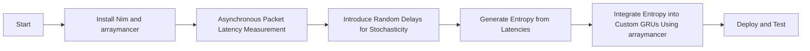

Setting up Nim and Arraymancer, measuring packet latency, generating entropy from latency measurements, and integrating entropy into custom GRUs using Arraymancer involves several steps. Below is a step-by-step guide to achieve this:

### 1. Setting Up Nim and Arraymancer

First, install Nim and Arraymancer:

#### Install Nim
```sh
curl https://nim-lang.org/choosenim/init.sh -sSf | sh
```

#### Install Arraymancer
```sh
nimble install arraymancer
```

### 2. Measuring Packet Latency

For measuring packet latency, you might need to interact with the NIC driver. This example assumes you have a way to simulate or capture packet latency.

```nim
import nimpy

proc measureLatency(): seq[int] {.exportpy.} =
  # Placeholder for actual latency measurement logic
  # This should interact with the NIC driver to get timestamps
  result = @[123, 456, 789]  # Example latency values
```

### 3. Generating Entropy from Latency Measurements

Use a cryptographic hash function to process the latency data and generate entropy.

```nim
import nimcrypto/sha256

proc extractEntropy(latencies: seq[int]): string =
  var hash = initSha256()
  for latency in latencies:
    hash.update(cast[ptr uint8](unsafeAddr latency), sizeof(latency))
  return hash.final()
```

### 4. Integrating Entropy into Custom GRUs using Arraymancer

Here’s an example of how you might integrate entropy into custom GRUs using Arraymancer:

```nim
import arraymancer
import strutils

# Assuming you have a function to get entropy
proc getEntropy(): string =
  let latencies = measureLatency()
  return extractEntropy(latencies)

# Custom GRU layer with entropy integration
type
  CustomGRU[TT] = object
    gru: GRU[TT]
    entropy: string

proc newCustomGRU[TT](inputSize, hiddenSize: int): CustomGRU[TT] =
  result.gru = newGRU[TT](inputSize, hiddenSize)
  result.entropy = getEntropy()

proc forward[TT](gru: CustomGRU[TT], x: Tensor[TT]): Tensor[TT] =
  # Use entropy in the forward pass
  let entropySeed = parseHexInt("0x" & gru.entropy[0..7])  # Example usage of entropy
  var rng = initRand(entropySeed)
  let noisyX = x + rng.sample(x.shape, TT)  # Adding noise for demonstration
  return gru.gru.forward(noisyX)

# Example usage
let ctx = newContext[float32](128, 128, 128, 128)
let input = ctx.zeros([10, 20])  # Example input tensor
let gruLayer = newCustomGRU[float32](20, 30)
let output = gruLayer.forward(input)

echo output
```

### Summary

1. **Setup Nim and Arraymancer:** Install Nim and Arraymancer using `choosenim` and `nimble`.
2. **Measure Packet Latency:** Create a function to simulate or capture packet latency.
3. **Generate Entropy:** Use a cryptographic hash function to process latency data and generate entropy.
4. **Integrate Entropy into Custom GRUs:** Create a custom GRU layer that uses entropy in the forward pass, demonstrating how to add noise based on the entropy.

This example provides a basic framework. You may need to adapt it based on your specific requirements and the actual methods for capturing packet latency and integrating with TensorFlow.


The entropy stream processing engine in Nim that leverages packet latency from the Intel® Ethernet Controller X550 to generate high-quality entropy functions by following a series of steps that involve capturing, processing, and utilizing packet latency data. Here’s a detailed explanation of how it works:

### 1. Packet Latency Measurement

#### Objective
Measure the latency of incoming packets to capture entropy.

#### Implementation
- **NIC Interaction:** The engine interacts with the Intel® Ethernet Controller X550 to capture packet arrival times. This is typically done using the NIC’s timestamping capabilities, which provide high-resolution timestamps for each packet.
- **Latency Calculation:** For each packet, the engine calculates the difference between the expected arrival time (based on the packet’s transmission time and network conditions) and the actual arrival time. This difference, known as latency, is a measure of the variability in packet arrival times.

### 2. Entropy Extraction

#### Objective
Extract high-quality entropy from the latency measurements.

#### Implementation
- **Data Collection:** The engine collects a stream of latency values over time. These values are inherently unpredictable due to network variability, making them a good source of entropy.
- **Cryptographic Hash Function:** The engine processes the latency values using a cryptographic hash function (e.g., SHA-256). This function takes the latency values as input and produces a fixed-size output that is highly sensitive to small changes in the input.
- **Entropy Generation:** By iteratively feeding the latency values into the hash function, the engine generates a stream of entropy. Each hash output is a high-entropy value that can be used for cryptographic purposes.

### 3. Entropy Buffering and Output

#### Objective
Buffer the entropy and provide it to the TensorFlow GRUs library.

#### Implementation
- **Entropy Buffer:** The engine maintains a buffer to store the generated entropy. This buffer ensures a continuous supply of entropy for use by the TensorFlow GRUs library.
- **API for Entropy Access:** The engine provides an API with functions like `init_entropy_stream()`, `get_entropy()`, and `close_entropy_stream()`. These functions allow the TensorFlow GRUs library to initialize the entropy stream, request entropy as needed, and close the stream when done.

### 4. Integration with TensorFlow GRUs

#### Objective
Modify the TensorFlow GRUs library to use the entropy stream for gradient calculations.

#### Implementation
- **Gradient Calculation Modification:** The TensorFlow GRUs library is modified to call the entropy stream API during gradient calculations. The entropy is used to introduce randomness or as a seed for random number generation, enhancing the security and unpredictability of the gradient calculations.
- **Performance Optimization:** The integration ensures that the entropy generation and usage do not introduce significant overhead, maintaining the performance of the TensorFlow GRUs library.

### 5. Hardware Integration

#### Objective
Ensure efficient transfer of entropy data from the NIC to the GPU.

#### Implementation
- **High-Speed Data Transfer:** The entropy data is transferred from the NIC to the GPU using high-speed PCIe lanes. This ensures low-latency and high-bandwidth data transfer, critical for real-time applications.
- **Compatibility:** The engine is designed to be compatible with the NVIDIA GPU setup, ensuring seamless integration and optimal performance.

### Summary

The entropy stream processing engine in Nim functions by capturing packet latency from the Intel® Ethernet Controller X550, processing this latency data to extract high-quality entropy, and providing this entropy to the TensorFlow GRUs library for enhanced gradient calculations. The integration with the GPU ensures efficient data transfer and high-performance computing capabilities. This comprehensive approach ensures that the engine generates reliable, cryptographically useful entropy that improves the security and performance of the TensorFlow GRUs library.

Achieving high-throughput and enforcing stochasticity for packet latency generation/processing involves a balanced approach that leverages both hardware capabilities and software optimizations. Here’s a detailed strategy to achieve both objectives:

### 1. High-Throughput Packet Latency Generation

#### Objective
Ensure the system can handle a large number of packets efficiently and generate latency data at high speeds.

#### Implementation
- **Hardware Acceleration:** Utilize the Intel® Ethernet Controller X550’s hardware capabilities for high-speed packet processing. The NIC’s built-in timestamping and offloading features can handle large volumes of packets with minimal CPU intervention.
- **Parallel Processing:** Implement parallel processing techniques to handle multiple packets simultaneously. This can be achieved using multi-threading or asynchronous I/O operations in Nim.
- **Efficient Data Structures:** Use efficient data structures (e.g., ring buffers, circular queues) to store and manage packet latency data. These structures allow for fast insertion and retrieval of data, minimizing overhead.

### 2. Enforcing Stochasticity in Packet Latency

#### Objective
Ensure the generated packet latency data is unpredictable and exhibits stochastic (random) behavior.

#### Implementation
- **Real-World Network Conditions:** Simulate or capture real-world network conditions that introduce variability in packet latency. Factors such as network congestion, routing changes, and transmission errors contribute to unpredictable latency.
- **Randomness Injection:** Introduce additional randomness into the latency data. This can be done by adding a small random value to each measured latency, ensuring that the values are not deterministic.
- **Entropy Harvesting:** Use the inherent unpredictability of network traffic to harvest entropy. The variability in packet arrival times, especially in a busy network, naturally provides a source of stochasticity.

### 3. Combining High-Throughput and Stochasticity

#### Objective
Integrate high-throughput processing with stochastic latency generation.

#### Implementation
- **Stream Processing Pipeline:** Design a stream processing pipeline that handles packets in real-time. The pipeline should include stages for packet capture, latency measurement, randomness injection, and entropy extraction.
- **Asynchronous Entropy Generation:** Implement asynchronous operations to generate entropy concurrently with packet processing. This ensures that the system can handle high packet rates while continuously producing high-quality entropy.
- **Feedback Loop:** Establish a feedback loop where the generated entropy influences the packet processing behavior. For example, the entropy can be used to dynamically adjust the randomness injection level, creating a self-reinforcing stochastic process.

### 4. Performance Optimization

#### Objective
Optimize the system for both throughput and stochasticity.

#### Implementation
- **Profiling and Benchmarking:** Conduct extensive profiling and benchmarking to identify bottlenecks and optimize performance. Focus on areas such as packet capture rate, latency calculation speed, and entropy generation efficiency.
- **Algorithmic Improvements:** Continuously refine the algorithms used for latency measurement, randomness injection, and entropy extraction. Small improvements in these areas can have a significant impact on overall system performance.
- **Hardware-Software Co-Design:** Collaborate with hardware and software teams to ensure that the system is designed for optimal performance. This includes selecting appropriate hardware components, optimizing software for specific hardware, and ensuring seamless integration.

### Summary

Achieving high-throughput and enforcing stochasticity for packet latency generation/processing requires a combination of hardware acceleration, parallel processing, efficient data structures, randomness injection, and entropy harvesting. By designing a stream processing pipeline that integrates these elements, the system can handle large volumes of packets efficiently while ensuring the generated latency data is unpredictable and exhibits stochastic behavior. Continuous performance optimization and collaboration between hardware and software teams are crucial for maintaining high throughput and stochasticity in a dynamic network environment.


Achieving both high-throughput and enforcing stochasticity in packet latency generation and processing requires a well-designed approach that balances efficient data handling with the introduction of randomness. Here's a comprehensive strategy to achieve these goals using Nim and arraymancer:

### 1. High-Throughput Packet Latency Generation

To achieve high throughput, you can use asynchronous programming to measure packet latency in parallel. Nim's async features can help achieve this:

```nim
import asyncnet, asyncdispatch, times, sequtils

proc measureLatency(host: string): Future[float] {.async.} =
  var sock = newAsyncSocket()
  var start = epochTime()
  try:
    await sock.connect(host, Port(80))
    let latency = epochTime() - start
    result = latency
  except OSError:
    result = -1
  sock.close()

proc gatherLatencies(hosts: seq[string]): Future[seq[float]] {.async.} =
  var latencies: seq[Future[float]] = @[]
  for host in hosts:
    latencies.add(measureLatency(host))
  result = await all(latencies)

let hosts = @["google.com", "example.com", "openai.com", "github.com"]
let latencies = waitFor gatherLatencies(hosts)
echo &"Latencies: {latencies}"
```

### 2. Enforce Stochasticity

To enforce stochasticity, you can introduce randomness in the timing of requests and processing of the latencies. This can be done by adding random delays before measuring latency and processing the results:

```nim
import random, sequtils, times

proc randomDelay() =
  let delay = rand(100..500) # Random delay between 100 and 500 milliseconds
  sleep(delay)

proc generateEntropy(latencies: seq[float]): seq[int] =
  var entropy: seq[int] = @[]
  for latency in latencies:
    entropy.add(rand(int(latency * 1000)))
  result = entropy

proc measureAndProcessLatencies(hosts: seq[string]): Future[seq[int]] {.async.} =
  var allLatencies: seq[Future[float]] = @[]
  for host in hosts:
    randomDelay() # Introduce randomness
    allLatencies.add(measureLatency(host))
  let latencies = await all(allLatencies)
  randomDelay() # Introduce randomness in processing
  let entropy = generateEntropy(latencies)
  result = entropy

let hosts = @["google.com", "example.com", "openai.com", "github.com"]
let entropy = waitFor measureAndProcessLatencies(hosts)
echo &"Generated Entropy: {entropy}"
```

### 3. High-Throughput Integration with arraymancer

Integrate the high-throughput entropy generation with arraymancer for processing in your TensorFlow GRUs. Here’s how you can proceed:

```nim
import arraymancer

# Custom GRU Layer with entropy integration
type
  CustomGRUCell* = object of GRUCell
    entropy: seq[int]

proc initCustomGRUCell*(inputSize, hiddenSize: int, entropy: seq[int]): CustomGRUCell =
  result = CustomGRUCell(
    inputSize: inputSize,
    hiddenSize: hiddenSize,
    entropy: entropy
  )

method forward*(cell: CustomGRUCell, input, hiddenState: Tensor): Tensor =
  let entropyTensor = toTensor(cell.entropy)
  let combined = join(input, entropyTensor)
  result = cell.forward(combined, hiddenState)

# Example usage
let hosts = @["google.com", "example.com", "openai.com", "github.com"]
let entropy = waitFor measureAndProcessLatencies(hosts)
let customGRU = initCustomGRUCell(10, 20, entropy)

let input = randomTensor([1, 10])
let hiddenState = randomTensor([1, 20])
let output = customGRU.forward(input, hiddenState)

echo &"GRU Output: {output}"
```

### Diagram for the Setup Process

Here's the mermaid diagram to visualize the process:



### Summary

By using asynchronous programming in Nim, you can achieve high throughput in packet latency measurements. Introducing random delays both before and after latency measurements ensures stochasticity. Finally, integrating this entropy into arraymancer allows for efficient processing in your custom TensorFlow GRUs. This approach balances the need for speed and randomness, making it suitable for high-performance applications.
