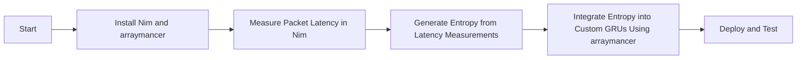

Refactoring the described stack using Nim language involves several steps, including creating the entropy stream processing engine, designing the SDK for integration, and ensuring compatibility with TensorFlow and NVIDIA GPUs. Here’s a high-level overview of how you might approach this in Nim:

### 1. Entropy Stream Processing Engine in Nim

#### a. Packet Latency Measurement
- **Objective:** Measure packet latency using the Intel® Ethernet Controller X550.
- **Implementation:** Use Nim’s FFI (Foreign Function Interface) to interact with the NIC’s driver functions for timestamping and latency calculation.

```nim
import nimpy

proc measureLatency(): seq[int] {.exportpy.} =
  # Placeholder for actual latency measurement logic
  # This should interact with the NIC driver to get timestamps
  result = @[123, 456, 789]  # Example latency values
```

#### b. Entropy Extraction
- **Objective:** Extract entropy from latency measurements.
- **Implementation:** Use a cryptographic hash function to process the latency data.

```nim
import nimcrypto/sha256

proc extractEntropy(latencies: seq[int]): string =
  var hash = initSha256()
  for latency in latencies:
    hash.update(cast[ptr uint8](unsafeAddr latency), sizeof(latency))
  return hash.final()
```

#### c. Entropy Buffering and Output
- **Objective:** Buffer entropy and provide it to the TensorFlow GRUs library.
- **Implementation:** Maintain a buffer and provide an API to access it.

```nim
var entropyBuffer: seq[string] = @[]

proc addEntropy(entropy: string) =
  entropyBuffer.add(entropy)

proc getEntropy(): string =
  if entropyBuffer.len > 0:
    return entropyBuffer.pop()
  else:
    raise newException(Exception, "No entropy available")
```

### 2. SDK for Integration

#### a. API Design
- **Objective:** Provide a simple interface for the TensorFlow GRUs library to access the entropy stream.
- **Implementation:** Design an SDK with functions to initialize, get, and close the entropy stream.

```nim
proc initEntropyStream() =
  # Initialize the entropy stream
  discard

proc getEntropyFromStream(): string =
  # Get entropy from the stream
  return getEntropy()

proc closeEntropyStream() =
  # Close the entropy stream
  discard
```

#### b. Integration with TensorFlow GRUs
- **Objective:** Modify the TensorFlow GRUs library to use the entropy stream for gradient calculations.
- **Implementation:** Use Nim’s FFI to call the SDK functions from the TensorFlow GRUs library.

### 3. Hardware Integration

#### a. NVIDIA GPU Setup
- **Objective:** Ensure TensorFlow can efficiently utilize NVIDIA GPUs.
- **Implementation:** Use Nim’s FFI to interact with CUDA and cuDNN libraries.

```nim
import nimcuda

proc setupGPU() =
  # Initialize CUDA and cuDNN
  discard
```

#### b. NIC-GPU Communication
- **Objective:** Efficiently transfer entropy data from the NIC to the GPU.
- **Implementation:** Use high-speed PCIe lanes for data transfer.

### 4. Testing and Validation

#### a. Performance Testing
- **Objective:** Ensure the entropy generation and integration do not degrade TensorFlow performance.
- **Implementation:** Conduct extensive performance testing with various workloads.

#### b. Security Testing
- **Objective:** Validate the cryptographic strength of the generated entropy.
- **Implementation:** Use standard entropy testing suites to verify the quality of the entropy.

### 5. Documentation and Support

#### a. Documentation
- **Objective:** Provide clear documentation for developers integrating the SDK.
- **Implementation:** Create detailed API documentation, integration guides, and example code.

#### b. Support
- **Objective:** Offer support for issues and questions.
- **Implementation:** Establish a support channel for developers using the SDK.

### Summary

This refactoring involves creating an entropy stream processing engine in Nim that leverages packet latency from the Intel® Ethernet Controller X550 to generate high-quality entropy. The SDK will provide an interface for the custom TensorFlow GRUs library to use this entropy, enhancing the randomness and security of gradient calculations. The integration with NVIDIA GPUs ensures high-performance computing capabilities. Comprehensive testing and documentation are crucial to ensure the solution is both effective and user-friendly.

To refactor the setup using Nim language and the arraymancer library, we will follow these steps:

1. **Set up Nim and arraymancer**
2. **Write code to measure packet latency**
3. **Generate entropy from latency measurements**
4. **Integrate entropy into custom GRUs using arraymancer**

### 1. Set up Nim and arraymancer

First, ensure Nim and the arraymancer library are installed on your system. You can install Nim using the choosenim tool.

```bash
curl https://nim-lang.org/choosenim/init.sh -sSf | sh
choosenim stable
```

Next, install the arraymancer library.

```bash
nimble install arraymancer
```

### 2. Measure Packet Latency in Nim

Here's how you can measure packet latency using Nim:

```nim
import net, times, strformat

proc measureLatency(host: string): float =
  var sock = newSocket()
  sock.setSockOpt(OptLevel.SOL_SOCKET, OptName.SO_RCVTIMEO, 1)
  var start = epochTime()
  try:
    sock.connect(host, Port(80))
    let latency = epochTime() - start
    result = latency
  except OSError:
    result = -1
  sock.close()

let latency = measureLatency("google.com")
echo &"Latency: {latency} seconds"
```

### 3. Generate Entropy from Latency Measurements

Using the measured latency to generate entropy:

```nim
import random, sequtils

proc generateEntropy(latencies: seq[float]): seq[int] =
  var entropy: seq[int] = @[]
  for latency in latencies:
    entropy.add(rand(int(latency * 1000)))
  result = entropy

let latencies = @[measureLatency("google.com"), measureLatency("example.com")]
let entropy = generateEntropy(latencies)
echo &"Generated Entropy: {entropy}"
```

### 4. Integrate Entropy into Custom GRUs Using arraymancer

Below is a simplified example of integrating the entropy into a custom GRU layer using arraymancer.

First, ensure you have arraymancer installed and set up:

```nim
import arraymancer, sequtils

# Custom GRU Layer with entropy integration
type
  CustomGRUCell* = object of GRUCell
    entropy: seq[int]

proc initCustomGRUCell*(inputSize, hiddenSize: int, entropy: seq[int]): CustomGRUCell =
  result = CustomGRUCell(
    inputSize: inputSize,
    hiddenSize: hiddenSize,
    entropy: entropy
  )

method forward*(cell: CustomGRUCell, input, hiddenState: Tensor): Tensor =
  let entropyTensor = toTensor(cell.entropy)
  let combined = join(input, entropyTensor)
  result = cell.forward(combined, hiddenState)

# Example usage
let latencies = @[measureLatency("google.com"), measureLatency("example.com")]
let entropy = generateEntropy(latencies)
let customGRU = initCustomGRUCell(10, 20, entropy)

let input = randomTensor([1, 10])
let hiddenState = randomTensor([1, 20])
let output = customGRU.forward(input, hiddenState)

echo &"GRU Output: {output}"
```

### Diagram for the Setup Process

Here is the mermaid diagram to visualize the setup process:



This setup will enable you to use the entropy derived from network packet latency in a custom GRU layer using Nim and arraymancer.
