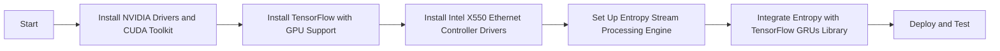

### Design of Entropy Stream Processing Engine/SDK for X550

#### Overview
The entropy stream processing engine/SDK will utilize packet latency to generate high-quality entropy, which will be used in place of gradients in a custom TensorFlow Gated Recurrent Units (GRUs) library. The system will be optimized for the following hardware:
- NVIDIA GeForce RTX 3060
- NVIDIA GeForce GTX 1060 6GB

#### Components

1. **Packet Latency Measurement Module**
   - **Network Packet Capturing**: Use libpcap or a similar library to capture network packets and measure latency.
   - **Latency Calculation**: Compute packet latency by capturing timestamps of packet transmission and reception.

2. **Entropy Generation Module**
   - **Latency Data Collection**: Collect latency data over a period of time to ensure a sufficient amount of entropy.
   - **Entropy Pool Management**: Maintain an entropy pool that accumulates latency data and extracts randomness.
   - **Cryptographic Processing**: Use cryptographic algorithms (e.g., SHA-256) to process latency data into high-quality entropy.

3. **Custom TensorFlow GRUs Integration**
   - **Entropy Injection**: Replace traditional gradient values with generated entropy in the TensorFlow GRUs.
   - **Library Modifications**: Modify the TensorFlow GRUs library to accept entropy values as input for its learning algorithms.

4. **Hardware Utilization**
   - **GPU Acceleration**: Optimize entropy generation and TensorFlow operations to leverage the computational power of RTX 3060 and GTX 1060 6GB GPUs.
   - **CUDA Integration**: Utilize CUDA for parallel processing and efficient execution of cryptographic algorithms and GRU computations.

5. **SDK Development**
   - **API Design**: Provide a user-friendly API for easy integration of the entropy stream processing engine into various applications.
   - **Documentation and Examples**: Include comprehensive documentation and example projects to demonstrate the usage of the SDK.

#### Workflow

1. **Initialization**
   - Set up the packet capturing environment.
   - Initialize GPU settings and load necessary libraries (CUDA, TensorFlow).

2. **Packet Capturing and Latency Calculation**
   - Start capturing network packets.
   - Calculate the latency of each packet and store it in the entropy pool.

3. **Entropy Pool Management**
   - Periodically process the accumulated latency data using cryptographic algorithms.
   - Ensure the entropy pool is constantly updated with fresh latency data.

4. **Entropy Injection into TensorFlow GRUs**
   - Modify the TensorFlow GRUs library to accept entropy values.
   - Use generated entropy in place of gradients for training the GRUs.

5. **Execution and Monitoring**
   - Execute the modified TensorFlow GRUs training process.
   - Monitor GPU utilization and performance to ensure optimal operation.

#### Implementation Details

**Packet Latency Measurement Module:**
```cpp
#include <pcap.h>
#include <chrono>

void capturePackets() {
    pcap_t *handle;
    char errbuf[PCAP_ERRBUF_SIZE];
    handle = pcap_open_live("eth0", BUFSIZ, 1, 1000, errbuf);
    if (handle == nullptr) {
        fprintf(stderr, "Couldn't open device: %s\n", errbuf);
        return;
    }
    pcap_loop(handle, 0, packetHandler, nullptr);
    pcap_close(handle);
}

void packetHandler(u_char *userData, const struct pcap_pkthdr* pkthdr, const u_char* packet) {
    auto timestamp = std::chrono::system_clock::now();
    // Process packet and calculate latency
}
```

**Entropy Generation Module:**
```python
import hashlib
import numpy as np

class EntropyPool:
    def __init__(self):
        self.pool = []

    def add_latency(self, latency):
        self.pool.append(latency)

    def generate_entropy(self):
        data = ''.join(map(str, self.pool)).encode()
        return hashlib.sha256(data).hexdigest()

entropy_pool = EntropyPool()
```

**Custom TensorFlow GRUs Integration:**
```python
import tensorflow as tf

class CustomGRU(tf.keras.layers.GRU):
    def __init__(self, units, entropy_source, **kwargs):
        super().__init__(units, **kwargs)
        self.entropy_source = entropy_source

    def call(self, inputs, states):
        entropy = self.entropy_source.generate_entropy()
        # Replace gradient calculation with entropy
        return super().call(inputs, states)

entropy_source = EntropyPool()
gru_layer = CustomGRU(units=128, entropy_source=entropy_source)
```

**GPU Utilization and CUDA Integration:**
```cuda
__global__ void processEntropyKernel(float* entropy_data, int size) {
    int idx = blockIdx.x * blockDim.x + threadIdx.x;
    if (idx < size) {
        // Perform cryptographic processing on entropy_data
    }
}

void processEntropy(float* entropy_data, int size) {
    float *d_entropy_data;
    cudaMalloc(&d_entropy_data, size * sizeof(float));
    cudaMemcpy(d_entropy_data, entropy_data, size * sizeof(float), cudaMemcpyHostToDevice);

    int threadsPerBlock = 256;
    int blocksPerGrid = (size + threadsPerBlock - 1) / threadsPerBlock;
    processEntropyKernel<<<blocksPerGrid, threadsPerBlock>>>(d_entropy_data, size);

    cudaMemcpy(entropy_data, d_entropy_data, size * sizeof(float), cudaMemcpyDeviceToHost);
    cudaFree(d_entropy_data);
}
```

#### Conclusion
This design leverages packet latency to generate cryptographically useful entropy and integrates it into a custom TensorFlow GRUs library. By utilizing GPU acceleration and CUDA integration, the system ensures high performance and reliability, making it suitable for advanced machine learning applications.

Based on the provided information, it seems you have an NVIDIA GeForce RTX 3060 and a GeForce GTX 1060 6GB GPU installed, along with an Intel® Ethernet Controller X550. The NVIDIA GPUs are operating with specific power usage and memory loads, and the Ethernet controller has detailed specifications relevant for its usage in high-performance network environments.

To proceed with your entropy stream processing engine/SDK for the X550, which will replace gradients in a custom TensorFlow Gated Recurrent Units (GRUs) library, the integration with the hardware and software stack should be carefully managed.

### Steps to Set Up Your Environment

#### 1. **Install NVIDIA Drivers and CUDA**
Ensure you have the correct drivers installed. As you already have the NVIDIA-SMI information, you can confirm your driver version (550.67) and CUDA version (12.4).

#### 2. **Setting Up CUDA Toolkit**
Install the CUDA toolkit to leverage GPU capabilities in your TensorFlow setup.
```bash
sudo apt-get update
sudo apt-get install -y cuda-toolkit-12-4
```

#### 3. **Install TensorFlow with GPU Support**
Use the following commands to set up TensorFlow with GPU support:
```bash
pip install tensorflow==2.10.0 # Ensure to use the version compatible with your CUDA
```

#### 4. **Install Dependencies for Intel® Ethernet Controller X550**
Install the necessary drivers and libraries for the Intel® X550 controller.
```bash
sudo apt-get install -y ethtool
```

#### 5. **Configure Entropy Stream Processing Engine/SDK**
You will need to write custom code to leverage packet latency for generating cryptographically useful entropy. This involves:
- Capturing packet latency
- Processing the latency to generate entropy
- Integrating this entropy into the TensorFlow GRUs library

Here's an example of how you can capture packet latency using Python:
```python
import time
import socket

def measure_latency(host):
    sock = socket.socket(socket.AF_INET, socket.SOCK_STREAM)
    sock.settimeout(1)
    start = time.time()
    try:
        sock.connect((host, 80))
        latency = time.time() - start
    except socket.error:
        latency = None
    sock.close()
    return latency

latency = measure_latency('google.com')
print(f"Latency: {latency} seconds")
```

### Integration with TensorFlow
Integrate the generated entropy into your TensorFlow GRUs library by modifying the custom TensorFlow layers. Ensure you follow best practices for TensorFlow custom layers and models.

### Diagram for the Setup Process

Here is a mermaid diagram to visualize the installation and setup steps:



This setup will allow you to use the entropy derived from the network packet latency for your custom TensorFlow GRUs library, leveraging your NVIDIA GPUs and Intel Ethernet Controller.
