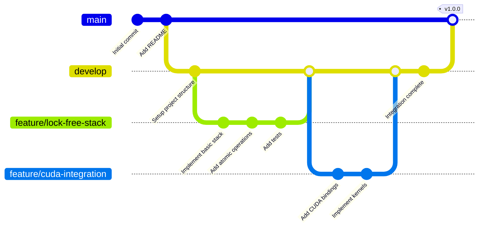
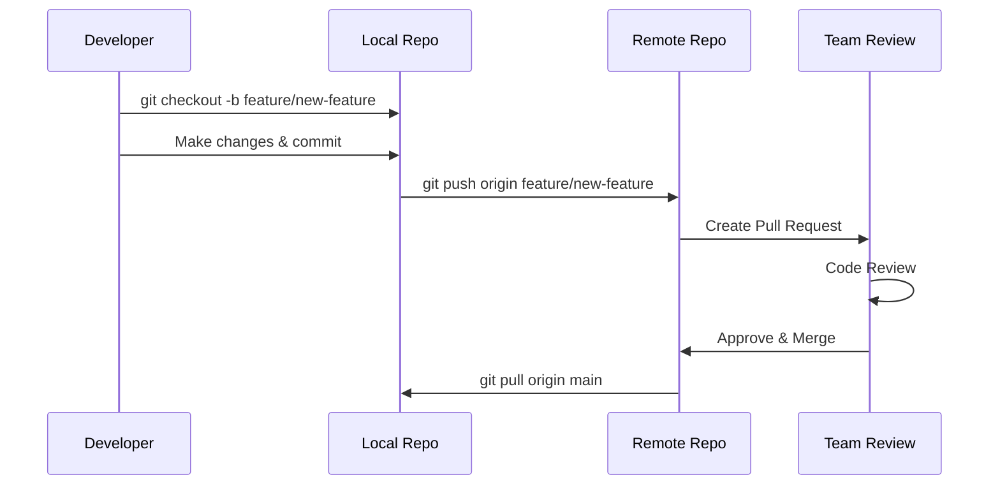
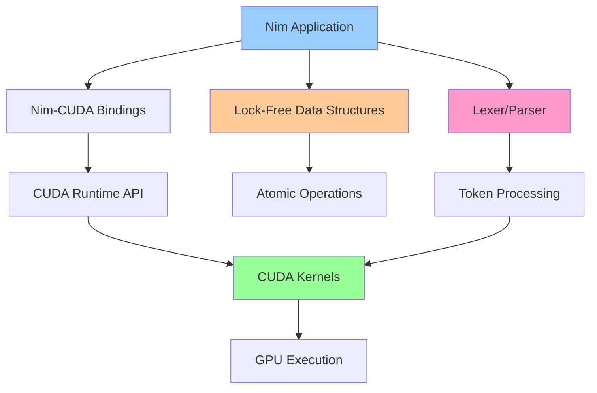
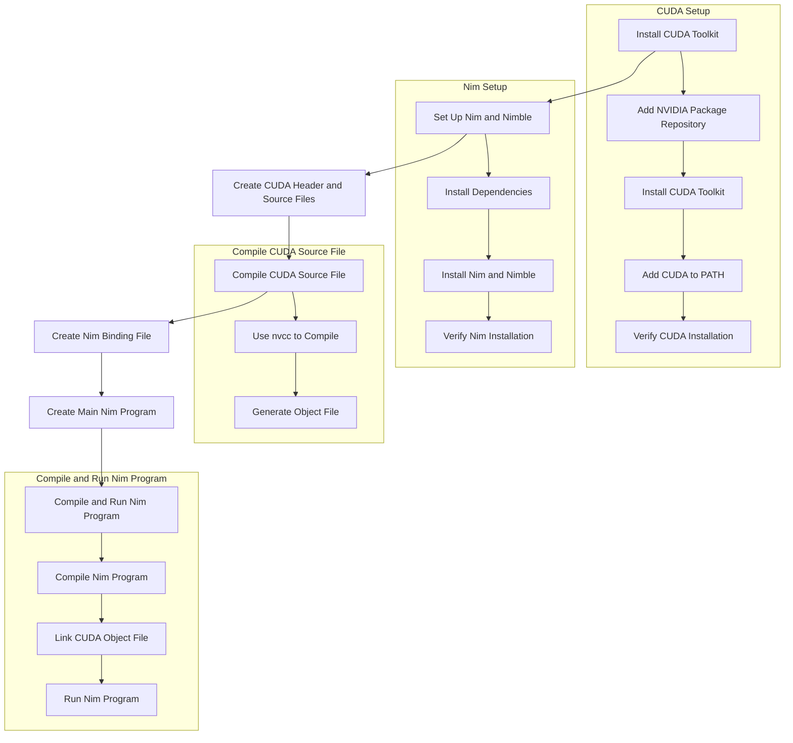

# GPT Nim - CUDA-Accelerated Lock-Free Data Structures

A comprehensive project combining CUDA GPU acceleration with Nim programming, featuring lock-free data structures, lexer/parser implementations, and advanced parallel computing capabilities.

## Table of Contents

- [Overview](#overview)
- [Project Structure](#project-structure)
- [Quick Start](#quick-start)
- [Git Workflow Guide](#git-workflow-guide)
- [Components](#components)
- [CUDA-Nim Integration](#cuda-nim-integration)
- [Lock-Free Data Structures](#lock-free-data-structures)
- [Installation](#installation)
- [Contributing](#contributing)
- [Resources](#resources)

---

## Overview

This repository provides a complete ecosystem for:

- **CUDA-Nim Integration**: Seamless integration between CUDA GPU computing and Nim programming
- **Lock-Free Data Structures**: High-performance concurrent data structures using atomic operations
- **Lexer/Parser Framework**: Efficient tokenization and parsing for complex grammars
- **Parallel Computing**: Leveraging GPU acceleration for data-intensive operations

### Key Features

- Lock-free stack, queue, and list implementations
- CUDA kernel integration with Nim
- Extended lexer/parser with operator precedence
- Comprehensive testing and benchmarking suite
- Visual documentation with Mermaid diagrams

---

## Project Structure

```
gpt_Nim/
├── README.md                      # This file
├── git_guide.md                   # Comprehensive Git workflow guide
├── markov_console.nim             # Markov chain console implementation
├── grimlock/                      # Main CUDA-Nim project
│   ├── readme.md                  # Grimlock project documentation
│   ├── lexpar_locker.md          # Lexer/parser documentation
│   ├── data_plane_slicer/        # Data processing components
│   └── [additional docs]
├── cupnic/                        # CUDA-Nim utilities
│   ├── readme.md                  # Cupnic documentation
│   └── [utility modules]
├── hulk/                          # Performance testing suite
├── pinchgems/                     # System integration guides
│   ├── install.md                 # Installation instructions
│   └── linux_kernel.md           # Kernel-level integration
└── LICENSE                        # Apache 2.0 License
```

---

## Quick Start

### Prerequisites

```bash
# CUDA Toolkit
nvidia-smi  # Verify GPU availability
nvcc --version  # Verify CUDA installation

# Nim Programming Language
nim --version  # Should be 1.6+ or later
```

### Basic Usage

```bash
# Clone the repository
git clone https://github.com/yourusername/gpt_Nim.git
cd gpt_Nim

# Compile and run a simple example
cd grimlock
nim c -r example.nim
```

See [Installation](#installation) for detailed setup instructions.

---

## Git Workflow Guide

We use a comprehensive Git workflow for collaboration. Here are the key diagrams:

### Basic Git Workflow


### Branch Strategy (Gitflow)



### Collaboration Workflow



For more detailed Git workflows, diagrams, and best practices, see our **[Comprehensive Git Guide](git_guide.md)**.

---

## Components

### Grimlock - Core CUDA-Nim Library

The main project component providing lock-free data structures and CUDA integration.

**Features:**
- Nim-CUDA bindings for seamless GPU integration
- Lock-free queue, stack, and list implementations
- High-performance lexer/parser framework
- Memory management utilities
- Comprehensive test suite

See [grimlock/readme.md](grimlock/readme.md) for detailed documentation.

### Cupnic - CUDA Utilities

Utility modules and helper functions for CUDA operations in Nim.

See [cupnic/readme.md](cupnic/readme.md) for documentation.

### Hulk - Performance Testing

Benchmarking and performance testing suite for evaluating lock-free structures.

See [hulk/readme.md](hulk/readme.md) for testing documentation.

---

## CUDA-Nim Integration

### Architecture Overview



### CUDA Setup Steps



### Example: CUDA Vector Addition

```nim
# cuda_example.nim
{.passL: "cuda_example.o", passL: "-lcudart".}

proc add*(n: int32, x: ptr float32, y: ptr float32) {.importc, cdecl.}

# main.nim
import cuda_example

let N = 1_000_000
var x, y: seq[float32]
# ... initialize data and call CUDA kernel
```

---

## Lock-Free Data Structures

### Why Lock-Free?

Lock-free data structures provide:
- **High Concurrency**: No thread blocking or waiting
- **Scalability**: Better performance with increasing thread count
- **Progress Guarantee**: At least one thread makes progress
- **No Deadlocks**: Elimination of lock-related issues

### Implementations

#### Lock-Free Stack (Treiber Stack)

```nim
type
  Node[T] = ptr object
    data: T
    next: Node[T]

  LockFreeStack[T] = object
    head: Atomic[Node[T]]

proc push[T](stack: var LockFreeStack[T], value: T)
proc pop[T](stack: var LockFreeStack[T]): Option[T]
```

#### Lock-Free Queue (Michael-Scott Queue)

```nim
type
  QueueNode[T] = ptr object
    data: T
    next: Atomic[QueueNode[T]]

  LockFreeQueue[T] = object
    head: Atomic[QueueNode[T]]
    tail: Atomic[QueueNode[T]]

proc enqueue[T](queue: var LockFreeQueue[T], value: T)
proc dequeue[T](queue: var LockFreeQueue[T]): Option[T]
```

### Lexer/Parser Framework


**Token Types:**
- Identifiers, numbers, operators
- Keywords, delimiters
- Comments, whitespace (optional)

**Parser Features:**
- Operator precedence handling
- Recursive descent parsing
- Error recovery
- AST construction

---

## Installation

### CUDA Setup

1. **Add NVIDIA Package Repository**:
   ```bash
   sudo apt-key adv --fetch-keys http://developer.download.nvidia.com/compute/cuda/repos/ubuntu2004/x86_64/7fa2af80.pub
   sudo sh -c 'echo "deb http://developer.download.nvidia.com/compute/cuda/repos/ubuntu2004/x86_64 /" > /etc/apt/sources.list.d/cuda.list'
   ```

2. **Install CUDA Toolkit**:
   ```bash
   sudo apt-get update
   sudo apt-get -y install cuda
   ```

3. **Add CUDA to PATH**:
   ```bash
   echo 'export PATH=/usr/local/cuda/bin${PATH:+:${PATH}}' >> ~/.bashrc
   echo 'export LD_LIBRARY_PATH=/usr/local/cuda/lib64${LD_LIBRARY_PATH:+:${LD_LIBRARY_PATH}}' >> ~/.bashrc
   source ~/.bashrc
   ```

4. **Verify CUDA Installation**:
   ```bash
   nvcc --version
   nvidia-smi
   ```

### Nim Setup

1. **Install Dependencies**:
   ```bash
   sudo apt-get update
   sudo apt-get -y install build-essential curl git
   ```

2. **Install Nim and Nimble**:
   ```bash
   curl https://nim-lang.org/choosenim/init.sh -sSf | sh
   export PATH=~/.nimble/bin:$PATH
   ```

3. **Verify Nim Installation**:
   ```bash
   nim --version
   nimble --version
   ```

### Building the Project

```bash
# Clone the repository
git clone https://github.com/yourusername/gpt_Nim.git
cd gpt_Nim

# Compile CUDA kernels
cd grimlock
nvcc -c -o cuda_kernels.o cuda_kernels.cu

# Build Nim components
nim c -r lockfree_stack.nim
nim c -r lexer.nim
nim c -r parser.nim

# Run tests
nim c -r tests/test_all.nim
```

For detailed installation instructions, see [pinchgems/install.md](pinchgems/install.md).

---

## Development Workflow

### Initial Request

The project originated from implementing lock-free data structures with a lexer/parser for Nim-generated code using Nim.

### Implementation Steps

1. **Basic Lock-Free Stack Implementation**:
   - `lockfree_stack.nim`: Implemented using atomic CAS operations
   - `push` and `pop` operations ensure lock-free concurrent access

2. **Basic Lexer Implementation**:
   - `lexer.nim`: Tokenizes mathematical expressions
   - Recognizes numbers, operators, parentheses, identifiers

3. **Basic Parser Implementation**:
   - `parser.nim`: Uses lock-free stack to store tokens
   - Builds Abstract Syntax Tree (AST)
   - Handles operator precedence and associativity

4. **Extended Grammar Support**:
   - Enhanced lexer for complex tokens (assignment, comparison, etc.)
   - Improved parser for sophisticated expressions
   - Support for multiple statement types

5. **CUDA Integration**:
   - Created Nim bindings for CUDA APIs
   - Compiled CUDA source files with `nvcc`
   - Linked CUDA object files during Nim compilation

---

## Contributing

We welcome contributions! Please follow these guidelines:

1. **Fork the repository** and create a feature branch
2. **Follow the Git workflow** outlined in [git_guide.md](git_guide.md)
3. **Write tests** for new functionality
4. **Document your code** with clear comments
5. **Submit a pull request** with a clear description

### Branch Naming Convention

```
feature/description      # New features
bugfix/description       # Bug fixes
hotfix/description       # Critical fixes
docs/description         # Documentation updates
refactor/description     # Code refactoring
test/description         # Test additions
```

### Commit Message Format

```
type(scope): subject

body (optional)

footer (optional)
```

**Types**: `feat`, `fix`, `docs`, `style`, `refactor`, `test`, `chore`

---

## Resources

### Documentation

- [Git Workflow Guide](git_guide.md) - Comprehensive Git diagrams and workflows
- [Grimlock Documentation](grimlock/readme.md) - Core library documentation
- [Installation Guide](pinchgems/install.md) - Detailed setup instructions

### External Resources

- [Nim Programming Language](https://nim-lang.org/)
- [CUDA Toolkit Documentation](https://docs.nvidia.com/cuda/)
- [Lock-Free Algorithms](https://en.wikipedia.org/wiki/Non-blocking_algorithm)
- [Mermaid Diagram Syntax](https://mermaid-js.github.io/)

### Research Papers

- Treiber Stack: "Systems programming: Coping with parallelism"
- Michael-Scott Queue: "Simple, Fast, and Practical Non-Blocking and Blocking Concurrent Queue Algorithms"
- Harris List: "A Pragmatic Implementation of Non-Blocking Linked-Lists"

---

## License

This project is licensed under the Apache License 2.0 - see the [LICENSE](LICENSE) file for details.

---

## Acknowledgments

- NVIDIA for CUDA toolkit and GPU computing frameworks
- Nim community for excellent language design and tooling
- Contributors to lock-free algorithm research
- Open source community for continuous inspiration

---

## Project Status

**Current Version**: 0.3.1

**Status**: Active Development

**Last Updated**: 2025-11-14

---

## Contact

For questions, issues, or contributions, please open an issue on GitHub or reach out to the maintainers.

---

*Built with passion for high-performance computing and elegant programming languages.*
