# Comprehensive Git Guide with Visual Diagrams

This guide provides visual representations of Git concepts, workflows, and operations using Mermaid diagrams.

## Table of Contents

1. [Git Basics](#git-basics)
2. [Git Areas and Workflow](#git-areas-and-workflow)
3. [Branching and Merging](#branching-and-merging)
4. [Remote Operations](#remote-operations)
5. [Collaboration Workflows](#collaboration-workflows)
6. [Advanced Operations](#advanced-operations)
7. [Git History and Navigation](#git-history-and-navigation)

---

## Git Basics

### Git Repository Structure

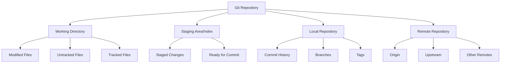

---

## Git Areas and Workflow

### Basic Git Workflow

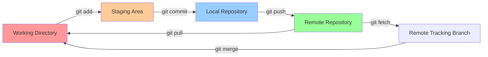

### File States and Transitions

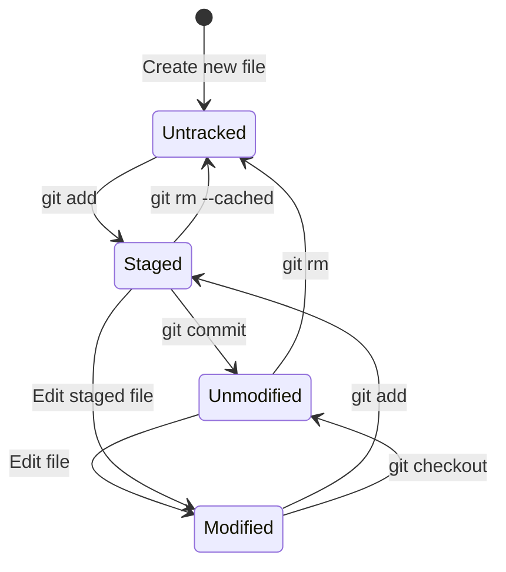

### Complete Git Command Flow

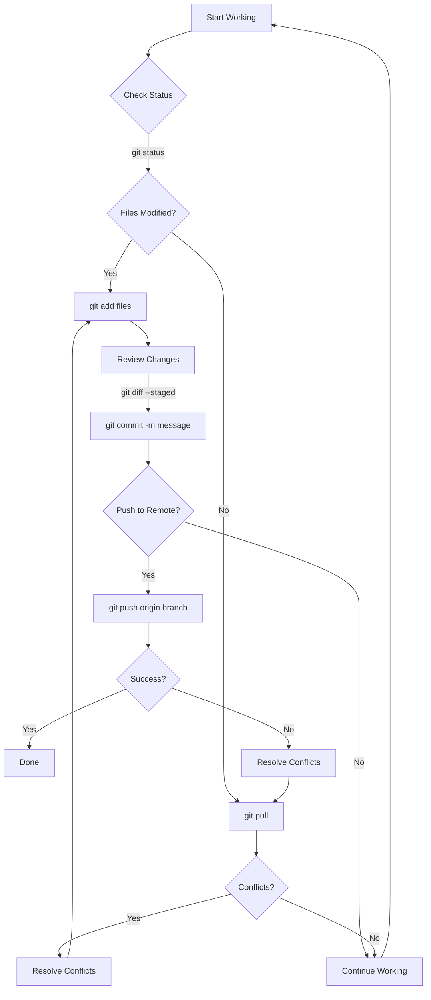

---

## Branching and Merging

### Git Branching Model

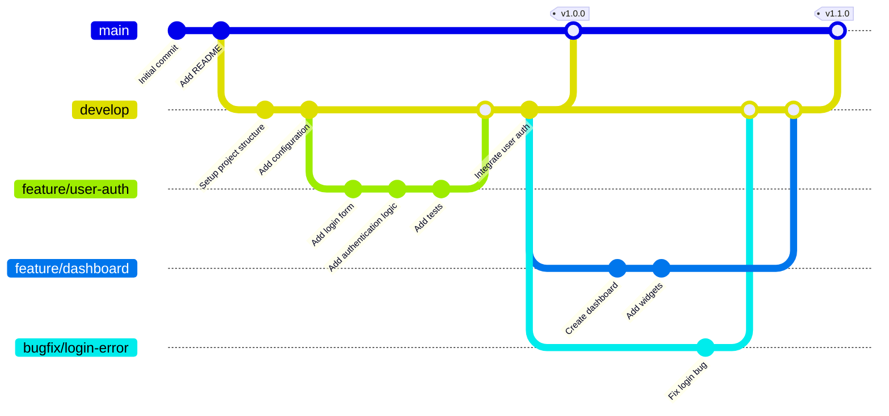

### Branch Operations

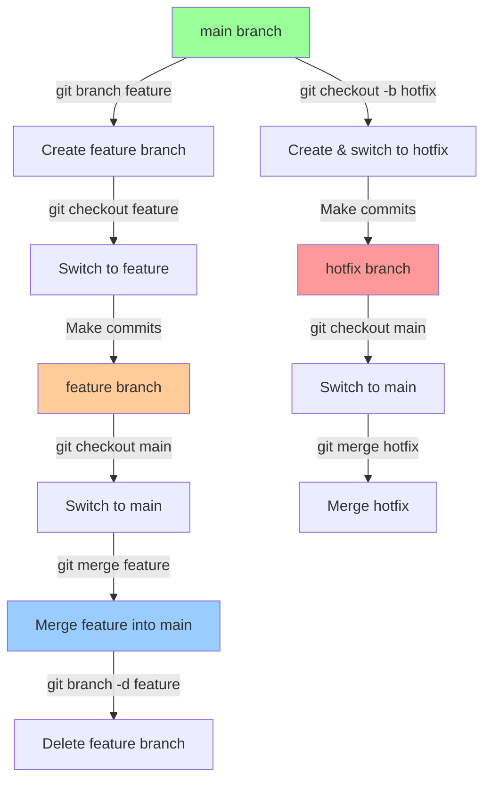

### Merge vs Rebase

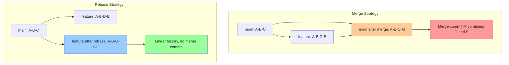

### Conflict Resolution Flow

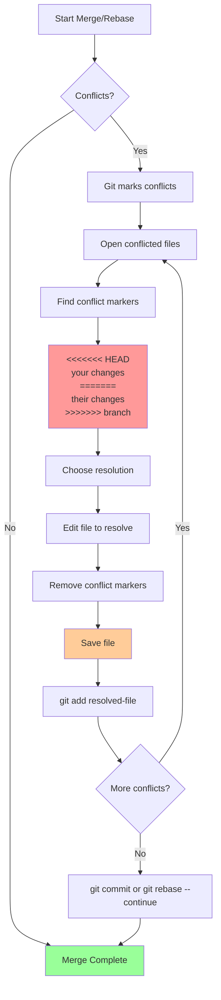

---

## Remote Operations

### Remote Repository Operations

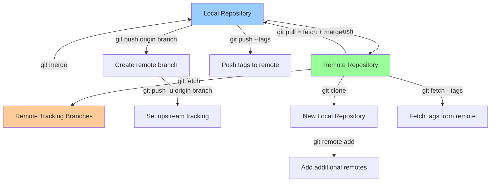

### Fork and Pull Request Workflow

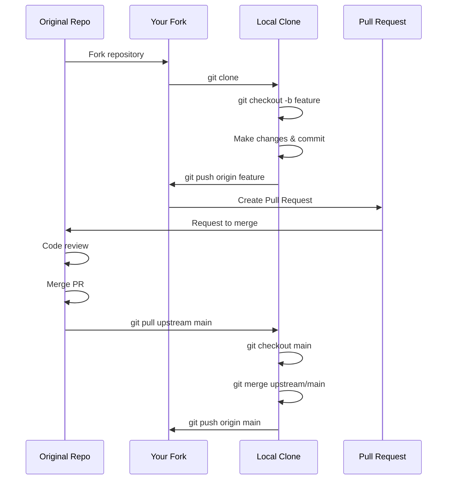

### Multi-Remote Setup

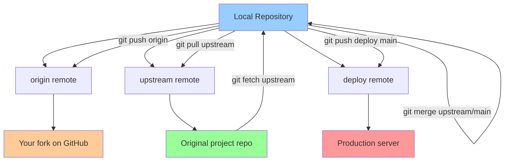

---

## Collaboration Workflows

### Gitflow Workflow

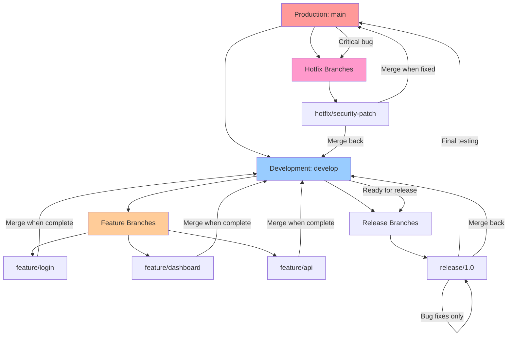

### Feature Branch Workflow

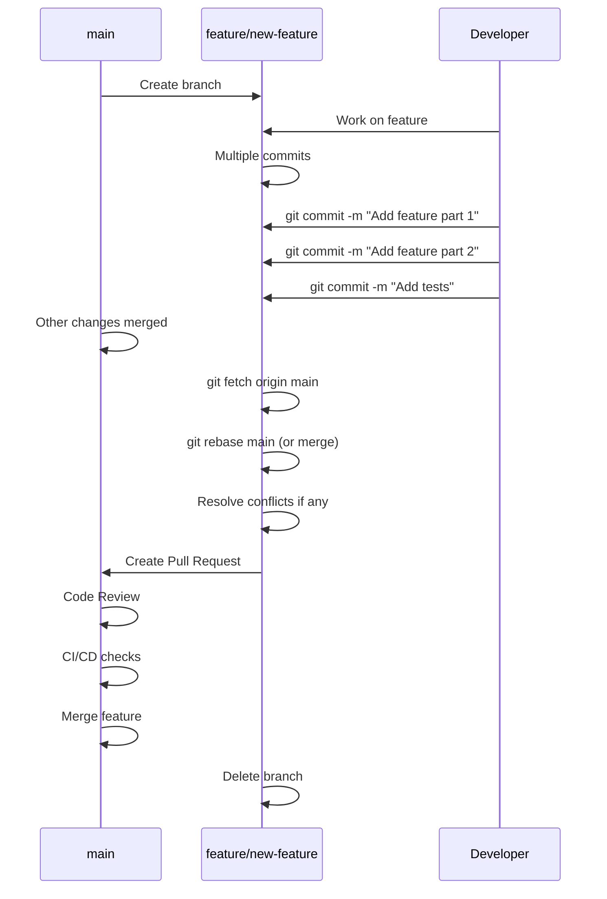

### Team Collaboration Flow

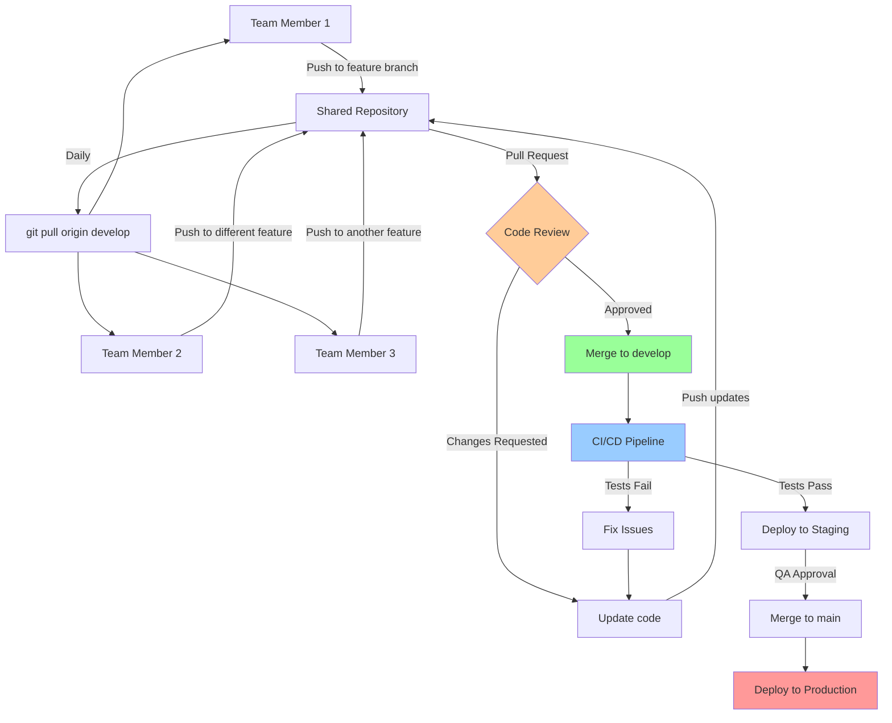

---

## Advanced Operations

### Cherry-Pick Operation

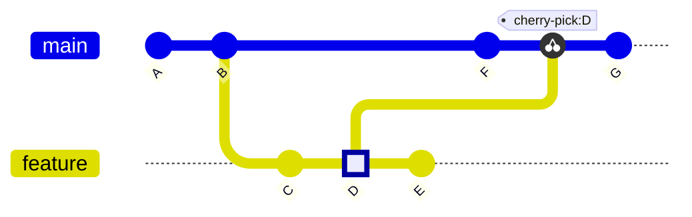

### Rebase Interactive Flow

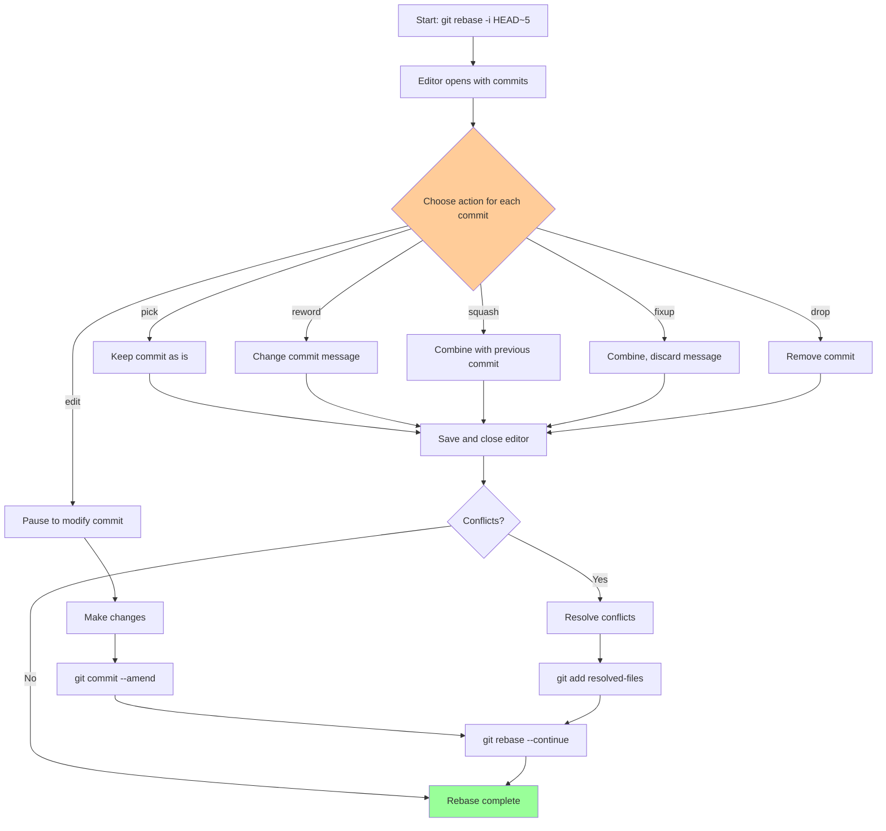

### Stash Operations

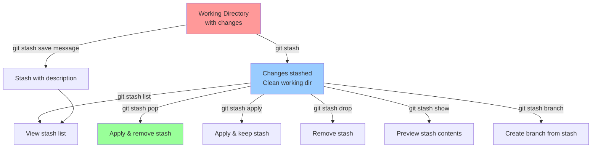

### Reset vs Revert

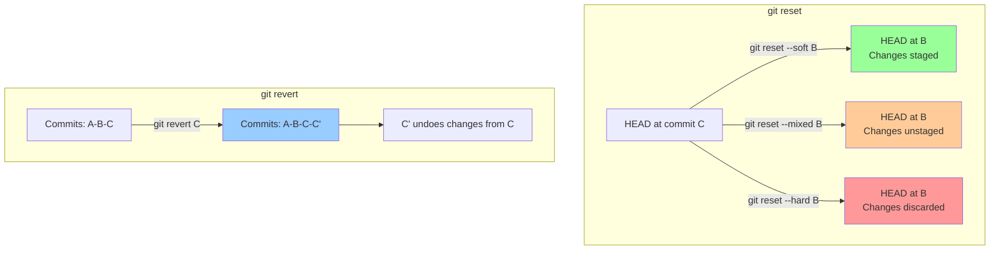

### Tag Management

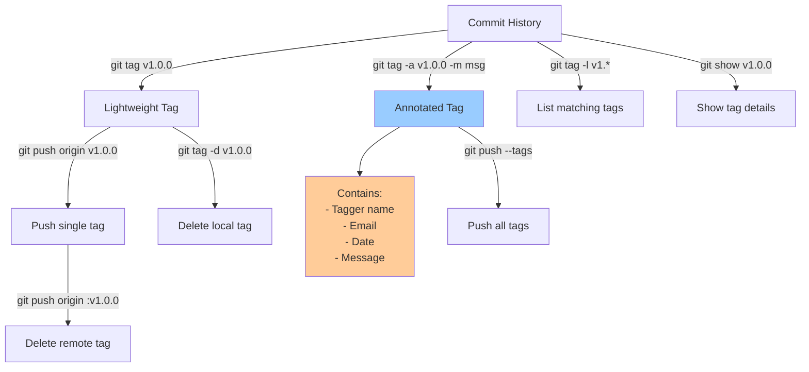

---

## Git History and Navigation

### Commit History Visualization

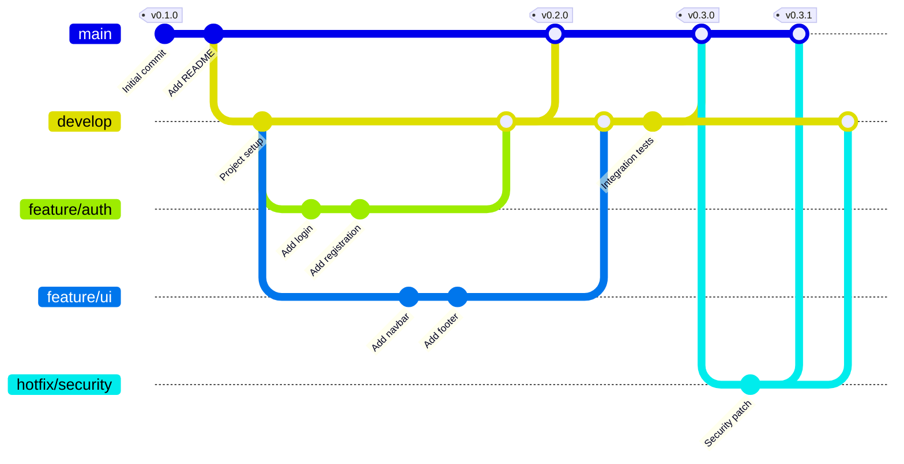

### Navigating History

```mermaid
graph TD
    A[HEAD] --> B[Current commit]
    B --> C[HEAD~1 or HEAD^]
    C --> D[HEAD~2 or HEAD^^]
    D --> E[HEAD~3 or HEAD^^^]

    B --> F[branch-name]
    B --> G[commit-hash]
    B --> H[tag-name]

    A -->|git checkout HEAD~2| I[Move to 2 commits back]
    A -->|git checkout branch| J[Move to branch tip]
    A -->|git checkout commit-hash| K[Move to specific commit]

    B -->|git log| L[View commit history]
    B -->|git log --graph| M[View graphical history]
    B -->|git log --oneline| N[View compact history]
    B -->|git reflog| O[View reference log]

    style A fill:#ff9999
    style B fill:#99ccff
    style L fill:#99ff99
```

### Commit Graph Relationships

```mermaid
graph TD
    A[Commit A<br/>Initial] --> B[Commit B<br/>Add feature]
    B --> C[Commit C<br/>Fix bug]
    B --> D[Commit D<br/>Branch feature]
    D --> E[Commit E<br/>Develop feature]
    C --> F[Commit F<br/>Merge commit]
    E --> F
    F --> G[Commit G<br/>Latest main]

    H[HEAD] -.-> G
    I[main] -.-> G
    J[origin/main] -.-> F
    K[feature/branch] -.-> E

    style A fill:#e1f5e1
    style G fill:#99ff99
    style F fill:#ffcc99
    style H fill:#ff9999
```

### Understanding Git References

```mermaid
graph LR
    A[Git References] --> B[Branches]
    A --> C[Tags]
    A --> D[HEAD]
    A --> E[Remote References]

    B --> B1[refs/heads/main]
    B --> B2[refs/heads/develop]
    B --> B3[refs/heads/feature/*]

    C --> C1[refs/tags/v1.0.0]
    C --> C2[refs/tags/v2.0.0]

    D --> D1[Current branch pointer]
    D --> D2[Detached HEAD state]

    E --> E1[refs/remotes/origin/main]
    E --> E2[refs/remotes/upstream/main]

    style A fill:#99ccff
    style B fill:#99ff99
    style C fill:#ffcc99
    style D fill:#ff9999
    style E fill:#cc99ff
```

---

## Best Practices

### Commit Message Convention

```mermaid
graph TD
    A[Good Commit Message] --> B[Type: feat, fix, docs, style, refactor, test, chore]
    A --> C[Scope: component or file affected]
    A --> D[Subject: short description]
    A --> E[Body: detailed explanation optional]
    A --> F[Footer: breaking changes, issue references]

    G[Example] --> H["feat(auth): add OAuth2 login<br/><br/>Implement OAuth2 authentication flow<br/>- Add login endpoint<br/>- Add token validation<br/>- Add refresh token logic<br/><br/>Closes #123"]

    style A fill:#99ccff
    style G fill:#99ff99
    style H fill:#ffcc99
```

### Branch Naming Convention

```mermaid
graph TD
    A[Branch Name] --> B[Type/Description]

    B --> C[feature/user-authentication]
    B --> D[bugfix/login-error]
    B --> E[hotfix/security-patch]
    B --> F[release/v1.2.0]
    B --> G[docs/api-documentation]
    B --> H[refactor/database-layer]
    B --> I[test/integration-tests]

    style A fill:#99ccff
    style C fill:#99ff99
    style D fill:#ffcc99
    style E fill:#ff9999
```

---

## Troubleshooting

### Common Issues and Solutions

```mermaid
flowchart TD
    A[Git Issue] --> B{What's wrong?}

    B -->|Committed to wrong branch| C[git cherry-pick commit-hash<br/>to correct branch]
    B -->|Need to undo last commit| D[git reset --soft HEAD~1]
    B -->|Pushed sensitive data| E[git filter-branch or BFG]
    B -->|Merge conflicts| F[Resolve manually,<br/>git add, git commit]
    B -->|Lost commits| G[git reflog to find,<br/>git cherry-pick to restore]
    B -->|Detached HEAD| H[git checkout branch-name<br/>or git switch -c new-branch]

    C --> Z[Resolved]
    D --> Z
    E --> Z
    F --> Z
    G --> Z
    H --> Z

    style B fill:#ffcc99
    style Z fill:#99ff99
```

---

## Quick Reference

### Essential Git Commands

| Command | Description | Diagram Reference |
|---------|-------------|-------------------|
| `git init` | Initialize a new repository | Repository Structure |
| `git clone <url>` | Clone a repository | Remote Operations |
| `git add <file>` | Stage changes | Basic Workflow |
| `git commit -m "msg"` | Commit staged changes | Basic Workflow |
| `git status` | Check working directory status | File States |
| `git log` | View commit history | Navigating History |
| `git branch <name>` | Create a new branch | Branch Operations |
| `git checkout <branch>` | Switch branches | Branch Operations |
| `git merge <branch>` | Merge branch into current | Branching Model |
| `git pull` | Fetch and merge from remote | Remote Operations |
| `git push` | Push commits to remote | Remote Operations |
| `git stash` | Temporarily save changes | Stash Operations |
| `git rebase <branch>` | Reapply commits on top of another | Rebase Flow |
| `git cherry-pick <hash>` | Apply specific commit | Cherry-Pick |
| `git reset <mode> <ref>` | Reset HEAD to a previous state | Reset vs Revert |
| `git revert <commit>` | Create new commit undoing changes | Reset vs Revert |
| `git tag <name>` | Create a tag | Tag Management |

---

## Additional Resources

- [Official Git Documentation](https://git-scm.com/doc)
- [Pro Git Book](https://git-scm.com/book/en/v2)
- [Git Cheat Sheet](https://education.github.com/git-cheat-sheet-education.pdf)
- [Interactive Git Branching Tutorial](https://learngitbranching.js.org/)

---

*This guide is designed to help developers understand Git through visual diagrams. Each diagram can be rendered using Mermaid in Markdown-compatible viewers.*
