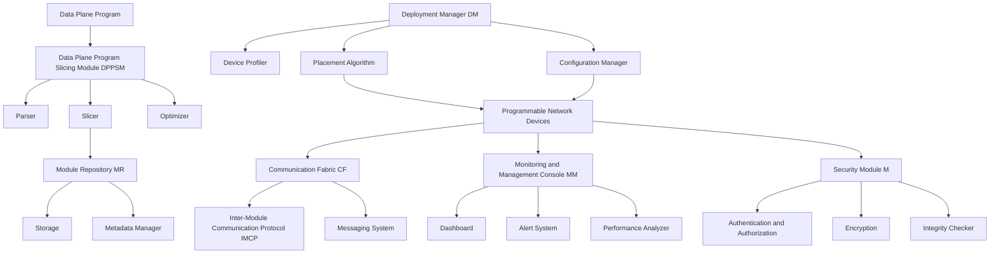

### Modular Framework for Slicing Data Plane Programs and Deploying on Distributed Programmable Network Devices

**Overview**:
The framework aims to slice data plane programs into modular components and deploy them across a distributed set of programmable network devices, such as SmartNICs, programmable switches, and routers. This approach enhances the scalability, flexibility, and efficiency of network operations by leveraging the capabilities of programmable network hardware.

### Framework Components:

1. **Data Plane Program Slicing Module (DPPSM)**:
   - **Function**: Decompose monolithic data plane programs into smaller, independent modules.
   - **Components**:
     - **Parser**: Analyzes the data plane program to identify discrete functions and dependencies.
     - **Slicer**: Divides the program into modular slices based on functionality and performance requirements.
     - **Optimizer**: Ensures optimal slicing to minimize inter-slice communication and maximize performance.

2. **Module Repository (MR)**:
   - **Function**: Store and manage the sliced data plane program modules.
   - **Components**:
     - **Storage**: A database or file system to store the modules.
     - **Metadata Manager**: Keeps track of module dependencies, versioning, and compatibility.

3. **Deployment Manager (DM)**:
   - **Function**: Deploy the sliced modules to the appropriate network devices.
   - **Components**:
     - **Device Profiler**: Identifies the capabilities and resources of each programmable network device.
     - **Placement Algorithm**: Determines the optimal deployment of modules across the devices based on performance, load balancing, and resource utilization.
     - **Configuration Manager**: Configures the devices and deploys the modules.

4. **Communication Fabric (CF)**:
   - **Function**: Facilitate communication between the distributed modules.
   - **Components**:
     - **Inter-Module Communication Protocol (IMCP)**: Defines the protocols for communication between modules.
     - **Messaging System**: Handles message passing, synchronization, and data sharing between modules.

5. **Monitoring and Management Console (MMC)**:
   - **Function**: Monitor the performance and status of the deployed modules and the network devices.
   - **Components**:
     - **Dashboard**: Provides a visual interface for monitoring and managing the network.
     - **Alert System**: Sends notifications and alerts based on predefined thresholds and anomalies.
     - **Performance Analyzer**: Analyzes the performance metrics of the modules and devices.

6. **Security Module (SM)**:
   - **Function**: Ensure the security and integrity of the sliced modules and the communication between them.
   - **Components**:
     - **Authentication and Authorization**: Manages access control for the modules and devices.
     - **Encryption**: Ensures secure communication between modules.
     - **Integrity Checker**: Verifies the integrity of the modules and the data being processed.

### Workflow:

1. **Program Slicing**:
   - The DPPSM parses the data plane program and slices it into modular components.
   - The sliced modules are optimized for performance and stored in the MR with their metadata.

2. **Device Profiling and Module Placement**:
   - The DM profiles the available programmable network devices to understand their capabilities.
   - The placement algorithm determines the optimal deployment strategy for the modules.

3. **Deployment**:
   - The configuration manager deploys the sliced modules to the appropriate devices.
   - The CF sets up the necessary communication protocols and messaging systems between the modules.

4. **Monitoring and Management**:
   - The MMC provides real-time monitoring and management capabilities.
   - Performance metrics are analyzed, and alerts are generated for any anomalies.

5. **Security Enforcement**:
   - The SM ensures secure communication and access control between the modules.
   - The integrity of the modules and the data is continuously verified.

### Diagram:

```mermaid
graph TD
    A[Data Plane Program] --> B[Data Plane Program Slicing Module (DPPSM)]
    B --> C[Parser]
    B --> D[Slicer]
    B --> E[Optimizer]
    D --> F[Module Repository (MR)]
    F --> G[Storage]
    F --> H[Metadata Manager]
    I[Deployment Manager (DM)] --> J[Device Profiler]
    I --> K[Placement Algorithm]
    I --> L[Configuration Manager]
    K --> M[Programmable Network Devices]
    L --> M
    N[Communication Fabric (CF)] --> O[Inter-Module Communication Protocol (IMCP)]
    N --> P[Messaging System]
    Q[Monitoring and Management Console (MMC)] --> R[Dashboard]
    Q --> S[Alert System]
    Q --> T[Performance Analyzer]
    U[Security Module (SM)] --> V[Authentication and Authorization]
    U --> W[Encryption]
    U --> X[Integrity Checker]
    M --> N
    M --> Q
    M --> U
```

### Summary:

This modular framework leverages the slicing of data plane programs to deploy them on a distributed set of programmable network devices. By breaking down the programs into modular components and deploying them strategically, this framework enhances scalability, flexibility, and efficiency, while ensuring robust security and real-time monitoring. The integration of advanced components like SmartNICs with ML acceleration further optimizes network operations for modern, high-performance network environments.


Creating a modular framework for slicing data plane programs and deploying them on a distributed set of programmable network devices involves several key components and steps. Here's a high-level outline of such a framework:

1. **Data Plane Program Slicing Module:**
   - **Input:** A data plane program written in a high-level language (e.g., P4, PISA).
   - **Output:** Sliced data plane programs tailored for specific network devices and their capabilities.
   - **Components:**
     - **Program Analyzer:** Parses the high-level data plane program to understand its structure and functionality.
     - **Device Profiler:** Collects information about the capabilities and constraints of each network device (e.g., processing power, memory, supported features).
     - **Slicer:** Divides the data plane program into smaller, modular components that can be deployed on different network devices. This involves optimizing each slice for the specific device's capabilities and ensuring that inter-device communication is efficient.

2. **Deployment Module:**
   - **Input:** Sliced data plane programs and a description of the network topology and device locations.
   - **Output:** Deployed data plane programs on the respective network devices.
   - **Components:**
     - **Topology Manager:** Maintains an up-to-date map of the network topology, including device locations and inter-device links.
     - **Deployment Planner:** Determines the optimal placement of each sliced data plane program on the network devices, considering factors such as latency, bandwidth, and device capabilities.
     - **Deployment Agent:** Communicates with network devices to upload and configure the sliced data plane programs. This may involve compiling the programs into device-specific formats and ensuring proper initialization and synchronization.

3. **Monitoring and Management Module:**
   - **Input:** Telemetry data from network devices and user-defined policies.
   - **Output:** Updated configurations, re-slicing of data plane programs, and alerts.
   - **Components:**
     - **Telemetry Collector:** Gathers real-time performance data and status information from network devices.
     - **Policy Engine:** Enforces user-defined policies, such as performance thresholds, security rules, and resource allocation constraints.
     - **Adaptation Manager:** Monitors the network and device conditions, and triggers re-slicing or re-deployment of data plane programs as needed to maintain optimal performance and compliance with policies.

4. **Communication and Coordination Module:**
   - **Input:** Messages and control signals between modules and network devices.
   - **Output:** Synchronized operations and consistent state across the framework and network devices.
   - **Components:**
     - **Message Bus:** Facilitates communication between different modules and network devices, ensuring reliable and efficient exchange of information.
     - **Coordination Manager:** Ensures that operations across the framework and network devices are synchronized, such as during deployment, re-slicing, or adaptation.

5. **User Interface Module:**
   - **Input:** User interactions and configuration requests.
   - **Output:** Visualizations, status updates, and configuration changes.
   - **Components:**
     - **Dashboard:** Provides a graphical user interface for monitoring the network, viewing performance metrics, and managing data plane programs.
     - **Configuration Manager:** Allows users to define policies, configure network settings, and upload new data plane programs.

**Integration and Workflow:**

1. **Data Plane Program Submission:** A user submits a high-level data plane program through the User Interface Module.
2. **Slicing Process:** The Data Plane Program Slicing Module analyzes the program, profiles the network devices, and slices the program into modular components.
3. **Deployment Planning:** The Deployment Module uses the network topology and device capabilities to plan the optimal placement of each sliced program.
4. **Deployment Execution:** The Deployment Agent uploads and configures the sliced programs on the respective network devices.
5. **Monitoring and Adaptation:** The Monitoring and Management Module collects telemetry data, enforces policies, and adapts the network configuration as needed.
6. **Communication and Coordination:** The Communication and Coordination Module ensures that all modules and network devices are synchronized and communicate effectively.

This modular framework provides a scalable and flexible approach to slicing data plane programs and deploying them on a distributed set of programmable network devices, enabling efficient resource utilization, optimal performance, and easy management of network functions.
