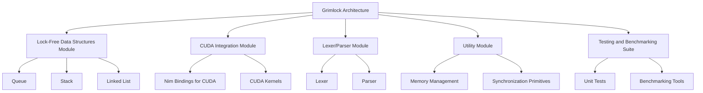

**Project Title:** Grimlock

**Project Description:**
Grimlock is a high-performance, lock-free data structure library for Nim language, designed to leverage CUDA for accelerated processing. The library will focus on providing efficient lexer/parser functionalities, enabling developers to process large datasets with minimal latency and overhead.

**Objective:**
To create a Nim library that integrates CUDA for parallel processing, offering lock-free data structures and efficient lexer/parser capabilities for handling complex data parsing tasks.

**Key Features:**
1. **Lock-Free Data Structures:** Implement lock-free data structures to ensure thread safety and high concurrency without the overhead of locks.
2. **CUDA Integration:** Utilize NVIDIA's CUDA platform to offload computationally intensive tasks to GPU, significantly boosting performance.
3. **Lexer/Parser:** Develop a robust lexer/parser module capable of handling various data formats and parsing rules efficiently.
4. **Modular Design:** Organize the library into modular components for easy maintenance, extensibility, and integration with other projects.
5. **Performance Optimization:** Optimize the library for maximum throughput and minimal latency, suitable for real-time data processing applications.

**Technologies and Tools:**
- **Nim Language:** Primary programming language for developing the library.
- **CUDA Toolkit:** For GPU acceleration and parallel computing.
- **Git and GitHub:** Version control and project management.
- **Benchmarking Tools:** For performance testing and optimization.

**Project Phases:**

1. **Research and Planning:**
   - Study existing lock-free data structures and CUDA libraries.
   - Define the scope and requirements of the project.
   - Design the architecture and modular structure of Grimlock.

2. **Development:**
   - Implement basic lock-free data structures (e.g., queues, stacks).
   - Integrate CUDA for GPU acceleration.
   - Develop the lexer/parser module with support for common data formats (JSON, XML, CSV).
   - Write unit tests and integration tests to ensure correctness.

3. **Optimization and Testing:**
   - Profile and optimize the code for performance.
   - Conduct extensive benchmarking to measure throughput and latency.
   - Refine the library based on test results and user feedback.

4. **Documentation and Release:**
   - Create comprehensive documentation for users and contributors.
   - Prepare release notes and versioning.
   - Publish the library on Nimble and GitHub.

5. **Maintenance and Support:**
   - Provide ongoing support for bug fixes and feature requests.
   - Regularly update the library with new enhancements and optimizations.
   - Engage with the community to gather feedback and improve the library.

**Expected Outcomes:**
- A high-performance Nim library for lock-free data structures and lexer/parser functionalities.
- Enhanced data processing capabilities through CUDA-accelerated parsing.
- A valuable resource for developers working on data-intensive applications.

**Timeline:**
- **Phase 1: Research and Planning (2 weeks)**
- **Phase 2: Development (8 weeks)**
- **Phase 3: Optimization and Testing (4 weeks)**
- **Phase 4: Documentation and Release (2 weeks)**
- **Phase 5: Maintenance and Support (Ongoing)**

**Budget:**
- Development costs: $X,000
- Hardware (GPUs): $Y,000
- Miscellaneous expenses: $Z,000

**Team:**
- Project Lead: [Name]
- Software Developer (Nim and CUDA): [Name]
- QA and Testing Specialist: [Name]
- Documentation Specialist: [Name]

**Conclusion:**
Grimlock aims to revolutionize data processing in Nim by combining the power of lock-free data structures with CUDA-accelerated parsing. This project will provide a significant boost to applications requiring high-speed data handling and analysis.

**Research and Planning Phase Detailed Breakdown:**

**1. Study Existing Lock-Free Data Structures and CUDA Libraries:**
   - **Literature Review:** Conduct a thorough review of academic papers, technical reports, and existing codebases related to lock-free data structures and their applications in high-performance computing.
   - **Benchmark Analysis:** Evaluate popular lock-free libraries such as Folly (Facebook), JSR-166 (Java), and Boost.Lockfree (C++) to understand their design principles, performance characteristics, and limitations.
   - **CUDA Ecosystem:** Explore CUDA-accelerated libraries like Thrust, cuDF, and ArrayFire to understand how GPU computing can be leveraged for data processing tasks.
   - **Case Studies:** Analyze real-world applications that have successfully integrated lock-free data structures with CUDA for insights into practical challenges and solutions.

**2. Define the Scope and Requirements of the Project:**
   - **Functional Requirements:**
     - Identify the core functionalities needed for a lock-free data structure library, such as insertion, deletion, search, and traversal operations.
     - Determine the types of data structures to be supported (e.g., linked lists, hash tables, trees).
   - **Performance Requirements:**
     - Establish performance benchmarks for latency, throughput, and scalability.
     - Define acceptable levels of concurrency and thread safety.
   - **Compatibility Requirements:**
     - Ensure compatibility with major CUDA-enabled GPU architectures.
     - Support for different Nim compiler versions and operating systems.
   - **Security Requirements:**
     - Address potential security concerns related to concurrent access and data integrity.
   - **Usability Requirements:**
     - Design an intuitive API for easy integration and usage.
     - Provide comprehensive documentation and examples.

**3. Design the Architecture and Modular Structure of Grimlock:**
   - **High-Level Architecture:**
     - Outline the overall structure of the library, including core components, utility modules, and integration points with CUDA.
     - Define the interaction between CPU and GPU for data transfer and processing.
   - **Modular Design:**
     - Break down the library into logical modules such as data structures, CUDA kernels, memory management, and error handling.
     - Establish clear interfaces between modules to facilitate independent development and testing.
   - **Data Flow Diagram:**
     - Create diagrams illustrating how data flows through the library, from input to processing and output.
   - **Error Handling and Logging:**
     - Design a robust error handling mechanism to manage exceptions and errors in a lock-free environment.
     - Implement logging to aid in debugging and performance analysis.
   - **Testing Framework:**
     - Plan for unit testing, integration testing, and performance testing to ensure the reliability and efficiency of the library.

**Deliverables:**
- **Literature Review Report:** A comprehensive report summarizing the findings from the literature review and benchmark analysis.
- **Project Scope Document:** A detailed document outlining the scope, requirements, and constraints of the Grimlock project.
- **Architecture Design Document:** A technical document describing the high-level architecture, modular structure, and data flow within Grimlock.
- **Prototype or Proof of Concept:** A preliminary implementation of key components to validate the design and feasibility of the project.

**Timeline:**
- **Week 1-2: Literature Review and Benchmark Analysis**
- **Week 3: Define Project Scope and Requirements**
- **Week 4: Design Architecture and Modular Structure**
- **Week 5: Develop Prototype/Proof of Concept**

**Conclusion:**
The research and planning phase is crucial for laying the groundwork of Grimlock. By thoroughly studying existing solutions and defining a clear scope and architecture, the project can proceed with a solid foundation, ensuring that the final product meets the high-performance expectations of its users.

### Research and Planning for Project Grimlock

**Objective**:
The primary goal of the research and planning phase is to gather comprehensive knowledge about existing lock-free data structures and CUDA libraries, define the project's scope and requirements, and design the architecture and modular structure for Grimlock.

### 1. Study Existing Lock-Free Data Structures and CUDA Libraries

#### Lock-Free Data Structures

1. **Research Papers and Algorithms**:
   - Study foundational research papers on lock-free data structures such as Michael and Scott's queue, Treiber's stack, and Harris's linked list.
   - Explore algorithms and techniques used in lock-free programming, including atomic operations, compare-and-swap (CAS), and memory management techniques.

2. **Existing Libraries**:
   - Analyze existing lock-free data structure libraries (e.g., Concurrency Kit, liblfds) to understand their implementation details, strengths, and limitations.
   - Evaluate the performance benchmarks and use cases of these libraries.

3. **Concurrent Programming Techniques**:
   - Study advanced concurrent programming techniques and patterns such as lock-free synchronization, memory reclamation (Hazard Pointers, Epoch-Based Reclamation), and wait-free algorithms.

#### CUDA Libraries

1. **CUDA Programming Guide**:
   - Study the official CUDA Programming Guide to understand the fundamentals of CUDA programming, including memory hierarchy, parallel execution, and optimization techniques.

2. **CUDA Libraries and Frameworks**:
   - Analyze existing CUDA libraries and frameworks (e.g., Thrust, cuBLAS, cuDNN) to understand their design, APIs, and performance characteristics.
   - Explore how these libraries handle parallelism, data transfer, and memory management.

3. **Performance Optimization**:
   - Study performance optimization techniques for CUDA, including memory coalescing, shared memory usage, and efficient kernel launches.
   - Evaluate profiling tools such as NVIDIA Visual Profiler and Nsight for identifying performance bottlenecks.

### 2. Define the Scope and Requirements of the Project

#### Scope

1. **Core Features**:
   - Implement essential lock-free data structures: queue, stack, and linked list.
   - Develop a lexer and parser for efficient data processing.
   - Integrate CUDA for parallel processing capabilities.

2. **Performance Goals**:
   - Achieve high concurrency and low latency in lock-free data structures.
   - Optimize CUDA kernels for maximum performance on NVIDIA GPUs.

3. **Usability**:
   - Provide a simple and intuitive API for developers.
   - Ensure compatibility with Nim’s existing tools and libraries.

#### Requirements

1. **Functional Requirements**:
   - Implement lock-free data structures that support concurrent operations without traditional locks.
   - Develop CUDA kernels for parallel data processing tasks.
   - Create a lexer and parser capable of tokenizing and parsing input data efficiently.

2. **Non-Functional Requirements**:
   - Performance: Ensure low latency and high throughput in data structures and CUDA kernels.
   - Scalability: Design the library to handle large-scale data and high concurrency.
   - Reliability: Ensure correctness and robustness through extensive testing.
   - Maintainability: Design a modular architecture to facilitate ease of maintenance and future enhancements.

3. **Development Environment**:
   - Programming Languages: Nim for high-level implementation, CUDA C/C++ for kernel development.
   - Tools and Frameworks: Nimble (package manager), NVIDIA CUDA Toolkit, Git for version control.

### 3. Design the Architecture and Modular Structure of Grimlock

#### Architecture Design

1. **High-Level Architecture**:
   - **Core Modules**:
     - **Lock-Free Data Structures Module**: Implements the core data structures.
     - **CUDA Integration Module**: Handles interaction with CUDA APIs and kernel execution.
     - **Lexer/Parser Module**: Provides functionality for tokenizing and parsing input data.
     - **Utility Module**: Contains utility functions for memory management and synchronization.

2. **Inter-Module Communication**:
   - Define clear interfaces and communication protocols between modules to ensure modularity and separation of concerns.
   - Use Nim's type system and metaprogramming capabilities to create flexible and reusable components.

#### Modular Structure

1. **Lock-Free Data Structures Module**:
   - **Queue**:
     - Implement Michael and Scott's lock-free queue using atomic operations.
     - Provide enqueue and dequeue operations with safety guarantees.
   - **Stack**:
     - Implement Treiber's lock-free stack.
     - Provide push and pop operations with safety guarantees.
   - **Linked List**:
     - Implement Harris's lock-free linked list.
     - Provide insert and delete operations with safety guarantees.

2. **CUDA Integration Module**:
   - **Nim Bindings for CUDA**:
     - Develop bindings to allow Nim code to interact with CUDA APIs.
     - Ensure efficient data transfer between Nim and CUDA.
   - **CUDA Kernels**:
     - Implement CUDA kernels for parallel processing tasks.
     - Optimize kernels for performance on NVIDIA GPUs.

3. **Lexer/Parser Module**:
   - **Lexer**:
     - Implement a tokenizer that converts input data into tokens.
     - Ensure efficiency and scalability for large inputs.
   - **Parser**:
     - Develop a parser that constructs a parse tree or AST from tokens.
     - Support different parsing techniques as needed.

4. **Utility Module**:
   - **Memory Management**:
     - Provide functions for efficient memory allocation and deallocation.
     - Implement custom allocators and memory pools for performance.
   - **Synchronization Primitives**:
     - Develop lightweight synchronization primitives for coordination between CUDA and Nim.

5. **Testing and Benchmarking Suite**:
   - **Unit Tests**:
     - Write comprehensive tests for all components.
     - Use Nim's testing framework for structured testing.
   - **Benchmarking Tools**:
     - Develop tools to measure performance.
     - Benchmark against traditional data structures and concurrency models.

### Diagram:

### Summary:

The research and planning phase of Project Grimlock involves an in-depth study of existing lock-free data structures and CUDA libraries, defining the scope and requirements, and designing a robust architecture and modular structure. This phase ensures that Grimlock is built on a solid foundation, leveraging the strengths of Nim and CUDA to provide high-performance, concurrent data structures with efficient data processing capabilities. The modular approach facilitates maintainability, scalability, and future enhancements, making Grimlock a powerful tool for developers working on data-intensive and parallel computing applications.
