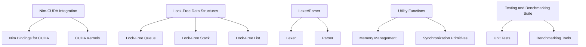

### Project: Grimlock

**Overview**:
Grimlock is a project aimed at developing a CUDA library in Nim that provides lock-free data structures with a lexer/parser for efficient data processing. The goal is to harness the power of CUDA for parallel computing while utilizing the simplicity and performance of the Nim programming language. Lock-free data structures help in achieving high concurrency and performance by avoiding traditional locking mechanisms.

### Project Components:

1. **Nim-CUDA Integration**:
   - **Function**: Integrate CUDA capabilities within the Nim programming environment.
   - **Components**:
     - **Nim Bindings for CUDA**: Create Nim bindings to interact with CUDA APIs.
     - **CUDA Kernels**: Develop CUDA kernels for parallel data processing.

2. **Lock-Free Data Structures**:
   - **Function**: Implement lock-free data structures for high-performance concurrent programming.
   - **Components**:
     - **Lock-Free Queue**: A queue implementation that allows multiple threads to enqueue and dequeue without locks.
     - **Lock-Free Stack**: A stack implementation that supports lock-free push and pop operations.
     - **Lock-Free List**: A linked list that allows concurrent insertions and deletions without locking.

3. **Lexer/Parser**:
   - **Function**: Develop a lexer and parser for processing input data efficiently.
   - **Components**:
     - **Lexer**: Tokenizes the input data into a sequence of tokens.
     - **Parser**: Analyzes the token sequence and generates a parse tree or abstract syntax tree (AST).

4. **Utility Functions**:
   - **Function**: Provide utility functions for common tasks related to data processing and concurrency.
   - **Components**:
     - **Memory Management**: Efficient memory allocation and deallocation functions.
     - **Synchronization Primitives**: Lightweight synchronization primitives for coordinating between CUDA and Nim.

5. **Testing and Benchmarking Suite**:
   - **Function**: Ensure the correctness and performance of the library.
   - **Components**:
     - **Unit Tests**: Comprehensive unit tests for all components.
     - **Benchmarking Tools**: Tools to measure the performance of lock-free data structures and CUDA kernels.

### Detailed Component Descriptions:

#### Nim-CUDA Integration

- **Nim Bindings for CUDA**:
  - Develop Nim bindings that allow seamless interaction with CUDA APIs.
  - Ensure the bindings are optimized for performance and ease of use.

- **CUDA Kernels**:
  - Implement CUDA kernels for parallel processing tasks such as sorting, searching, and mathematical computations.
  - Optimize kernels for performance on NVIDIA GPUs.

#### Lock-Free Data Structures

- **Lock-Free Queue**:
  - Implement a lock-free queue using atomic operations to ensure thread safety without traditional locks.
  - Utilize algorithms such as Michael and Scott's queue for high performance.

- **Lock-Free Stack**:
  - Develop a lock-free stack using atomic operations for concurrent push and pop operations.
  - Implement the Treiber stack algorithm for efficiency.

- **Lock-Free List**:
  - Create a lock-free linked list that supports concurrent insertions and deletions.
  - Use Harris's algorithm for a non-blocking linked list.

#### Lexer/Parser

- **Lexer**:
  - Tokenize input data into meaningful tokens for parsing.
  - Implement efficient tokenization algorithms to handle large input sizes.

- **Parser**:
  - Develop a parser that generates a parse tree or AST from the token sequence.
  - Support various parsing techniques such as recursive descent and LR parsing.

#### Utility Functions

- **Memory Management**:
  - Provide functions for efficient memory allocation and deallocation in CUDA and Nim environments.
  - Implement memory pools and custom allocators for performance.

- **Synchronization Primitives**:
  - Develop lightweight synchronization primitives to coordinate between CUDA kernels and Nim code.
  - Include primitives like atomic counters and barriers.

#### Testing and Benchmarking Suite

- **Unit Tests**:
  - Write comprehensive unit tests for all components to ensure correctness.
  - Use Nim's testing framework for structured and automated testing.

- **Benchmarking Tools**:
  - Develop tools to measure the performance of lock-free data structures and CUDA kernels.
  - Benchmark against traditional data structures and other concurrency models.

### Diagram:



### Summary:

Grimlock aims to combine the strengths of Nim and CUDA to provide a high-performance library for lock-free data structures with a lexer/parser. The project focuses on concurrency, efficiency, and seamless integration between Nim and CUDA, making it a powerful tool for developers working on data-intensive and parallel computing applications. The modular approach ensures flexibility, maintainability, and scalability, addressing the needs of modern high-performance computing environments.

```markdown
# CUDA Nim Stack Installation and Lexer/Parser Implementation

This repository provides instructions for setting up a CUDA Nim stack and includes a lock-free data structure lexer/parser implemented in Nim.

## Table of Contents

1. [Installation](#installation)
    - [CUDA Setup](#cuda-setup)
    - [Nim Setup](#nim-setup)
2. [Usage](#usage)
    - [Compile CUDA Source File](#compile-cuda-source-file)
    - [Create Nim Binding File](#create-nim-binding-file)
    - [Create Main Nim Program](#create-main-nim-program)
    - [Compile and Run Nim Program](#compile-and-run-nim-program)
3. [Extended Lexer/Parser](#extended-lexerparser)
    - [Extended Lexer](#extended-lexer)
    - [Extended Parser](#extended-parser)

## Installation

### CUDA Setup

1. **Add NVIDIA Package Repository**:
    ```bash
    sudo apt-key adv --fetch-keys http://developer.download.nvidia.com/compute/cuda/repos/ubuntu2004/x86_64/7fa2af80.pub
    sudo sh -c 'echo "deb http://developer.download.nvidia.com/compute/cuda/repos/ubuntu2004/x86_64 /" > /etc/apt/sources.list.d/cuda.list'
    ```

2. **Install CUDA Toolkit**:
    ```bash
    sudo apt-get update
    sudo apt-get -y install cuda
    ```

3. **Add CUDA to PATH**:
    ```bash
    echo 'export PATH=/usr/local/cuda/bin${PATH:+:${PATH}}' >> ~/.bashrc
    echo 'export LD_LIBRARY_PATH=/usr/local/cuda/lib64${LD_LIBRARY_PATH:+:${LD_LIBRARY_PATH}}' >> ~/.bashrc
    source ~/.bashrc
    ```

4. **Verify CUDA Installation**:
    ```bash
    nvcc --version
    ```

### Nim Setup

1. **Install Dependencies**:
    ```bash
    sudo apt-get update
    sudo apt-get -y install build-essential curl
    ```

2. **Install Nim and Nimble**:
    ```bash
    curl https://nim-lang.org/choosenim/init.sh -sSf | sh
    export PATH=~/.nimble/bin:$PATH
    ```

3. **Verify Nim Installation**:
    ```bash
    nim --version
    ```

## Usage

### Compile CUDA Source File

1. **Create CUDA Header File (`cuda_example.h`)**:
    ```c
    // cuda_example.h
    #ifndef CUDA_EXAMPLE_H
    #define CUDA_EXAMPLE_H

    __global__ void add(int n, float *x, float *y);

    #endif
    ```

2. **Create CUDA Source File (`cuda_example.cu`)**:
    ```c
    // cuda_example.cu
    #include "cuda_example.h"

    __global__
    void add(int n, float *x, float *y) {
      int index = blockIdx.x * blockDim.x + threadIdx.x;
      int stride = blockDim.x * gridDim.x;
      for (int i = index; i < n; i += stride) {
        y[i] = x[i] + y[i];
      }
    }
    ```

3. **Compile the CUDA Source File**:
    ```bash
    nvcc -c -o cuda_example.o cuda_example.cu
    ```

### Create Nim Binding File

1. **Create `cuda_example.nim`**:
    ```nim
    # cuda_example.nim
    {.passL: "cuda_example.o", passL: "-lcudart".}

    type
      float32* {.importc: "float", header: "cuda_example.h".} = float
      PtrFloat* {.importc: "float*", header: "cuda_example.h".} = ptr float

    proc add*(n: int32, x: PtrFloat, y: PtrFloat) {.importc, dynlib: "cuda_example".}
    ```

### Create Main Nim Program

1. **Create `main.nim`**:
    ```nim
    # main.nim
    import strutils
    import sequtils
    import cuda_example

    # Define CUDA error checking function
    proc checkCUDAError(errorMessage: cstring) =
      let err = cudaGetLastError()
      if err != cudaSuccess:
        echo "CUDA error: ", $err, " at ", errorMessage

    # Main program
    when isMainModule:
      let N = 1_000_000
      var x: seq[float32] = newSeq[float32](N)
      var y: seq[float32] = newSeq[float32](N)

      # Initialize input data
      for i in 0..<N:
        x[i] = 1.0'f32
        y[i] = 2.0'f32

      var d_x, d_y: PtrFloat
      # Allocate memory on the GPU
      assert cudaMalloc(cast[ptr pointer](addr d_x), N * sizeof(float32)) == cudaSuccess
      assert cudaMalloc(cast[ptr pointer](addr d_y), N * sizeof(float32)) == cudaSuccess

      # Copy data to the GPU
      assert cudaMemcpy(d_x, cast[ptr void](x[0].addr), N * sizeof(float32), cudaMemcpyHostToDevice) == cudaSuccess
      assert cudaMemcpy(d_y, cast[ptr void](y[0].addr), N * sizeof(float32), cudaMemcpyHostToDevice) == cudaSuccess

      # Perform the computation on the GPU
      add(N, d_x, d_y)

      # Copy the results back to the host
      assert cudaMemcpy(cast[ptr void](y[0].addr), d_y, N * sizeof(float32), cudaMemcpyDeviceToHost) == cudaSuccess

      # Check for CUDA errors
      checkCUDAError("add")

      # Output sample results
      echo "Sample output y[0..4]: ", y[0..4]

      # Free GPU memory
      cudaFree(d_x)
      cudaFree(d_y)
    ```

### Compile and Run Nim Program

1. **Compile and Run the Nim Program**:
    ```bash
    nim c -r main.nim
    ```

## Extended Lexer/Parser

### Extended Lexer

1. **Extended `lexer.nim`**:
    ```nim
    import strutils, sequtils

    type
      TokenKind = enum
        tkIdentifier, tkNumber, tkPlus, tkMinus, tkMul, tkDiv, tkLParen, tkRParen, tkEOF, tkAssign, tkSemicolon, tkLess, tkGreater, tkEqual

    type
      Token = object
        kind: TokenKind
        lexeme: string

    proc lex(input: string): seq[Token] =
      var result: seq[Token] = @[]
      var i = 0
      while i < input.len:
        case input[i]
        of '0'..'9':
          var start = i
          while i < input.len and input[i].isDigit:
            inc(i)
          result.add(Token(kind: tkNumber, lexeme: input[start..i-1]))
        of '+':
          result.add(Token(kind: tkPlus, lexeme: "+"))
          inc(i)
        of '-':
          result.add(Token(kind: tkMinus, lexeme: "-"))
          inc(i)
        of '*':
          result.add(Token(kind: tkMul, lexeme: "*"))
          inc(i)
        of '/':
          result.add(Token(kind: tkDiv, lexeme: "/"))
          inc(i)
        of '(':
          result.add(Token(kind: tkLParen, lexeme: "("))
          inc(i)
        of ')':
          result.add(Token(kind: tkRParen, lexeme: ")"))
          inc(i)
        of '=':
          result.add(Token(kind: tkAssign, lexeme: "="))
          inc(i)
        of ';':
          result.add(Token(kind: tkSemicolon, lexeme: ";"))
          inc(i)
        of '<':
          result.add(Token(kind: tkLess, lexeme: "<"))
          inc(i)
        of '>':
          result.add(Token(kind: tkGreater, lexeme: ">"))
          inc(i)
        of ' ', '\t', '\n', '\r':
          inc(i)  # Skip whitespace
        else:
          if input[i].isAlpha:
            var start = i
            while i < input.len and input[i].isAlphaNum:
              inc(i)
            result.add(Token(kind: tkIdentifier, lexeme: input[start..i-1]))
          else:
            echo "Unexpected character: ", input[i]
            inc(i)
      result.add(Token(kind: tkEOF, lexeme: ""))
      return result
    ```

### Extended Parser

1. **Extended `parser.nim`**:
    ```nim
    import lockfree_stack, lexer

    type
      ASTNodeKind = enum
        nkNumber, nkIdentifier, nkBinaryOp, nkAssignment, nkExpression

    type
      ASTNode = ref object
        kind: ASTNodeKind
        value: string
        left: ASTNode
        right: ASTNode

    type
      Parser = object
        tokens: seq[Token]
        pos: int
        stack: LockFreeStack

    proc initParser(tokens: seq[Token]): Parser =
      result.tokens

 = tokens
      result.pos = 0
      result.stack = initLockFreeStack()

    proc currentToken(parser: Parser): Token =
      if parser.pos < parser.tokens.len:
        result = parser.tokens[parser.pos]
      else:
        result = Token(kind: tkEOF, lexeme: "")

    proc nextToken(parser: var Parser): Token =
      result = currentToken(parser)
      inc(parser.pos)

    proc parsePrimary(parser: var Parser): ASTNode =
      let token = nextToken(parser)
      case token.kind
      of tkNumber:
        result = ASTNode(kind: nkNumber, value: token.lexeme)
      of tkIdentifier:
        result = ASTNode(kind: nkIdentifier, value: token.lexeme)
      of tkLParen:
        result = parseExpression(parser)
        discard nextToken(parser) # consume ')'
      else:
        echo "Unexpected token: ", token.lexeme

    proc parseBinaryOpRHS(parser: var Parser, exprPrec: int, lhs: ASTNode): ASTNode =
      while true:
        let tokPrec = getTokenPrecedence(currentToken(parser))
        if tokPrec < exprPrec:
          return lhs

        let binOp = currentToken(parser)
        discard nextToken(parser)

        var rhs = parsePrimary(parser)
        let nextPrec = getTokenPrecedence(currentToken(parser))

        if tokPrec < nextPrec:
          rhs = parseBinaryOpRHS(parser, tokPrec + 1, rhs)

        lhs = ASTNode(kind: nkBinaryOp, value: binOp.lexeme, left: lhs, right: rhs)

    proc parseExpression(parser: var Parser): ASTNode =
      var lhs = parsePrimary(parser)
      result = parseBinaryOpRHS(parser, 0, lhs)

    proc getTokenPrecedence(token: Token): int =
      case token.kind
      of tkPlus, tkMinus:
        return 10
      of tkMul, tkDiv:
        return 20
      else:
        return -1

    proc printAST(node: ASTNode, level: int = 0) =
      if node == nil:
        return
      echo repeat("  ", level), node.value
      printAST(node.left, level + 1)
      printAST(node.right, level + 1)

    # Example usage
    let input = "3 + 5 * (10 - 4)"
    let tokens = lex(input)
    var parser = initParser(tokens)
    let ast = parseExpression(parser)
    printAST(ast)
    ```

### Summary

This repository provides a complete setup for integrating CUDA with Nim and implementing a lexer/parser using lock-free data structures. The lexer and parser have been extended to handle more complex grammars and data structures, including operator precedence and associativity. This setup can be further extended to support more complex language features as needed.
```

This `README.md` provides a comprehensive guide to setting up the CUDA Nim stack, creating and compiling CUDA and Nim files, and implementing and extending a lexer/parser in Nim.
